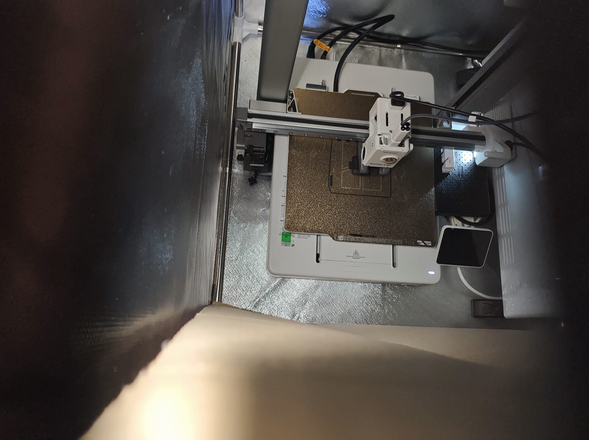

# Overview

Welcome to this research log.

This repository documents my experimental journey to understand **ABS filament printing**.

ABS is known for its difficulty compared with PLA and PETG, mainly because of:

- High thermal shrinkage
- Warping tendency
- Sensitivity to airflow
- Higher requirements for temperature stability

This study focuses on:

- Environmental temperature control
- Hardware reliability
- Extrusion stability
- Failure analysis
- Practical optimization methods

The goal is to understand what actually happens during ABS printing, why failures occur, and how the process can be improved through systematic testing.

# Research Goal

The purpose of this study is to understand ABS printing in a more practical and repeatable way.

ABS is often selected for functional parts because of its:

- Higher heat resistance
- Better impact resistance
- Long-term durability

However, compared with PLA and PETG, ABS requires a much more controlled printing environment.

Instead of only following recommended settings, this research investigates the actual causes behind printing failures through experiments.

## Main goals of this study

- Observe how ABS behaves under different enclosure temperatures and print conditions.

- Identify the most common failure modes during printing.

- Test how thermal stability affects warping, adhesion and extrusion reliability.

- Understand how different variables influence print quality.

- Build a practical workflow for printing demanding engineering materials.

# Material Background

## Why ABS 

ABS is a widely used engineering thermoplastic known for:

- High impact resistance
- Good toughness
- Better heat resistance compared with PLA
- Long-term mechanical stability

Compared with PLA and PETG, ABS is more demanding to print, but it is better suited for functional parts that need higher temperature resistance and durability.

## ABS vs PLA and PETG

### PLA

PLA is usually the easiest material to print.

Advantages:

- Excellent surface quality
- Low warping
- Easy printing process

Limitations:

- Lower heat resistance
- Lower impact resistance
- Less suitable for long-term mechanical stress

### PETG

PETG provides a balance between PLA and ABS.

Advantages:

- Stronger than PLA
- Better toughness
- Easier printing than ABS

Limitations:

- Lower heat resistance compared with ABS
- Different mechanical characteristics

### ABS

ABS provides:

- Higher heat resistance
- Better impact resistance
- Better suitability for functional components

However:

- Requires better temperature control
- More sensitive to cooling airflow
- More difficult to achieve reliable results

## Practical Differences

### Service life

ABS is generally better suited for long-term functional applications where parts experience:

- Mechanical stress
- Higher temperatures
- Repeated use

### Environmental resistance

ABS usually performs better than PLA in warmer environments.

PETG also performs well, especially when toughness and flexibility are required.

### Water resistance

ABS, PLA and PETG can all be used for parts exposed to moisture.

However, real performance depends on:

- Layer adhesion
- Geometry
- Infill
- Post-processing

ABS is often preferred when additional sealing or post-processing is required.

Because of these characteristics, ABS can be considered a **real test of a consumer FDM printer's thermal management capability**.

It is not only a material choice, but also a test of:

- Printer stability
- Enclosure design
- Temperature control
- Extrusion reliability

The filament used in this research was sponsored by my friend.

The filament had been stored at room temperature for an extended period, which may have affected its condition.

Before printing, it was dried at:

**65°C for 8 hours**

to reduce moisture-related issues.

# Test Setup

The following variables were adjusted during the experiments:

- Nozzle temperature

- Bed temperature

- Enclosure temperature

- Heater power

- Cooling fan speed

- Print speed

- Glue usage

- Build plate cleanliness

- Brim / draft shield usage

- Material profile

- Temperature control method

- Extrusion behavior

## General printer conditions

The following conditions were used throughout most experiments:

- ABS filament

- Heated bed

- Enclosure

- Low cooling fan speed

- Cleaned build plate

- Brim and draft shield when required

- Custom material profile

# Experimental Log

## Test 1 & Test 2

Open Test 1 & Test 2 details

## Test 1

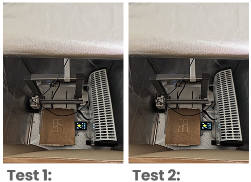

Settings:

- Nozzle: 250°C

- Bed: 100°C

- Heater: Off

- Temperature control: Manual

- Glue: None

- Ambient temperature: 17°C

- Enclosure temperature: 25°C

## Test 2

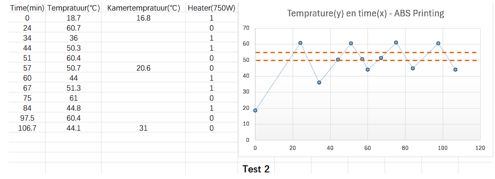

Settings:

- Nozzle: 250°C

- Bed: 100°C

- Heater: 750W

- Temperature control: Manual

- Glue: None

- Ambient temperature: 16.8°C

- Enclosure temperature: 50–60°C

## Test 1 & 2 Analysis

The first ABS tests showed that manually controlling the 750W heater created an extremely unstable enclosure temperature.

The temperature fluctuated between:

**36.7°C and 61°C**

This instability directly caused the print failure after approximately 40 minutes.

A critical problem was the sensor position.

The temperature sensor was mounted near the top of the enclosure and separated from the internal volume by a cardboard layer.

Because of this:

- The measured temperature was lower than the actual printing area.
- The temperature near the heated bed was likely higher.

The excessive heat caused:

**Heat creep**

The hotend cooling zone became too warm, causing the filament to soften before reaching the nozzle.

This eventually resulted in extrusion failure and filament jamming.

To reduce warping while avoiding overheating:

The enclosure temperature should remain stable around:

**50–55°C**

The recommended solution:

- Thermostat-controlled power outlet
- Sensor placed inside the enclosure
- Small temperature hysteresis (~5°C)

This avoids large temperature overshoot caused by manual adjustment.

## Test 3

Open Test 3 details

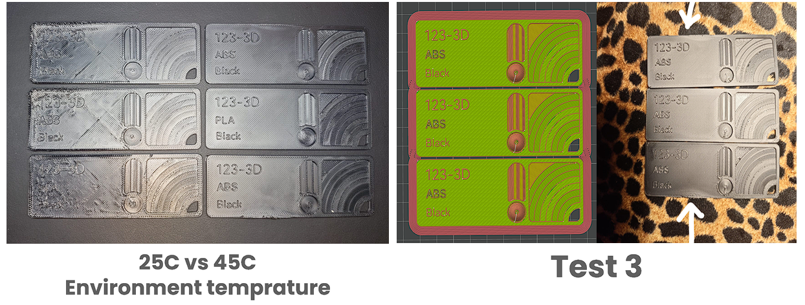

### Hypothesis: Thermal equilibrium and part positioning

By reducing heater power to around:

**400W**

a more stable thermal balance was achieved.

Compared with the previous 750W experiment, the enclosure temperature remained between:

**42–44°C**

At this point, the heat input from the heater was approximately equal to the heat loss through:

- Enclosure leakage
- Material conduction
- Natural convection

This reduced thermal fluctuations.

During this test:

Three identical parts were printed at the same time.

Observation:

- Middle part: almost perfect

- Top and bottom parts: visible warping

This suggests that the center area of the enclosure had the most stable thermal condition.

Because the parts were connected through the brim, shrink forces were transferred between them.

The outer areas experienced higher stress, while the middle position remained relatively stable.

Conclusion:

Before reaching the ideal ABS environment temperature:

**50–55°C**

both thermal stability and physical placement inside the printer are important factors.

## Test 4

Open Test 4 details

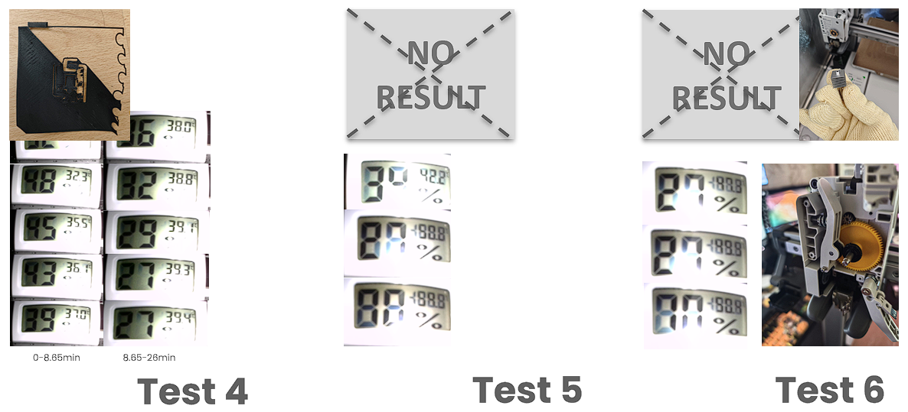

Settings:

- Speed: 100%

- Glue: Yes

- Heater: 350W

- Temperature control: Manual

- Fan speed: Low

- Build plate: Cleaned

- Brim and draft shield: Enabled

- Material profile: Custom ABS

Failure reason:

Average enclosure temperature was too low:

**Around 40°C**

Result:

The filament jammed inside the upper hotend section.

The hotend had to be removed, the blocked filament section cut away, and the system reassembled.

## Test 5

Open Test 5 details

Settings:

- Speed: 50%

- Glue: Yes

- Heater: 375W

- Temperature control: Manual

- Fan speed: Low

- Build plate: Cleaned

- Brim and draft shield: Enabled

- Material profile: Generic ABS

Failure reason:

The extrusion system was not checked after Test 4.

The remaining clog caused another failed print.

However, an important observation was made:

The **375W heater** was able to maintain:

**50–55°C enclosure temperature**

for an extended period.

This confirmed that lower power heating combined with insulation could provide much better thermal stability.

## Test 6

Open Test 6 details

Settings:

- Speed: 100%

- Glue: Yes

- Heater: 370W

- Temperature control: Manual

- Fan speed: Low

- Build plate: Cleaned

- Brim and draft shield: Enabled

- Material profile: Generic ABS

Failure reason (conjecture):

Possible causes:

- Filament moisture

- Poor glue adhesion

- Unknown machine issue

A complete maintenance check was performed.

Moving parts were lubricated, but the exact failure cause could not be confirmed.

At this stage, switching to PETG or ASA was considered instead of continuing ABS testing.

# Enclosure Upgrade

After several failed experiments, the enclosure system was improved.

Two major upgrades were introduced:

## 1. Improved insulation

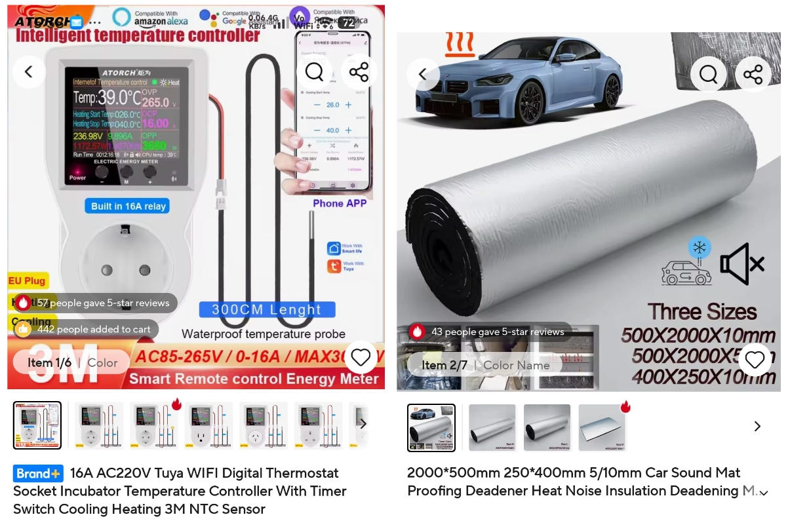

The enclosure interior was upgraded with:

- 10 mm aluminum-coated foam insulation
- Full coverage on four sides and the top
- Sealed gaps and seams

The purpose was to:

- Reduce heat loss
- Reduce temperature fluctuation
- Improve thermal stability

## 2. Automatic temperature control

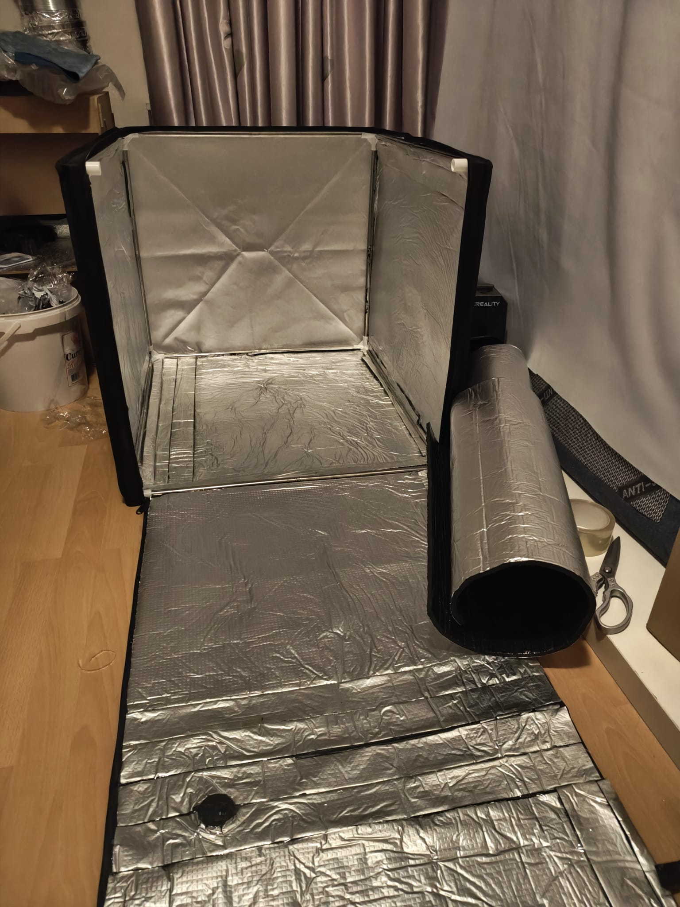

A thermostat-controlled outlet was added.

Control logic:

- Heater ON below 48°C
- Heater OFF above 51°C

After switching off, the enclosure temperature continued rising by approximately 2–3°C before cooling down.

This was caused by thermal inertia.

## Passive Cooling Comparison

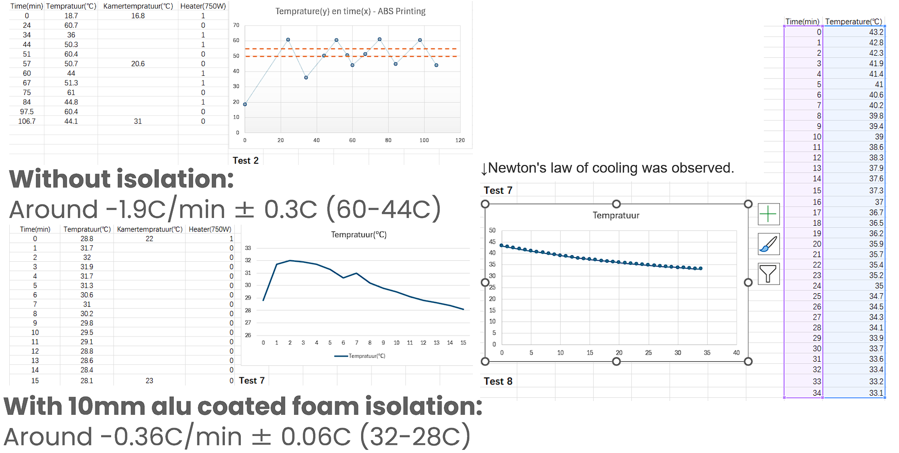

This comparison shows the cooling behavior before and after insulation improvement.

The comparison is not perfectly controlled because:

- Ambient temperatures were different
- Cooling conditions were not identical

According to Newton's law of cooling:

A smaller temperature difference between the object and environment results in slower temperature change.

The improved insulation significantly increased the thermal time constant of the enclosure.

## Test 7

Open Test 7 details

Settings:

- Speed: 100%

- Glue: None

- Heater: 370W

- Temperature control: Automatic

- Fan speed: Low

- Build plate: Cleaned

- Brim and draft shield: Enabled

- Material profile: Generic ABS

- Insulation upgrade: 10mm aluminum-coated foam

The enclosure temperature was now properly controlled.

However, a new problem appeared:

Failure reason (conjecture):

The first layer did not properly stick to the heated bed.

This suggested that enclosure temperature was no longer the only limiting factor.

Other possible factors:

- Extrusion reliability
- First layer calibration
- Surface condition

## Test 8

Open Test 8 details

Settings:

- Speed: 50%

- Glue: None

- Heater: 370W

- Temperature control: Automatic

- Fan speed: Low

- Build plate: Cleaned

- Brim and draft shield: Enabled

- Material profile: Generic ABS

This test investigated whether reducing print speed could improve:

- Adhesion
- Extrusion stability
- Printing reliability

However, the issue was not completely solved.

## Test 9

Open Test 9 details

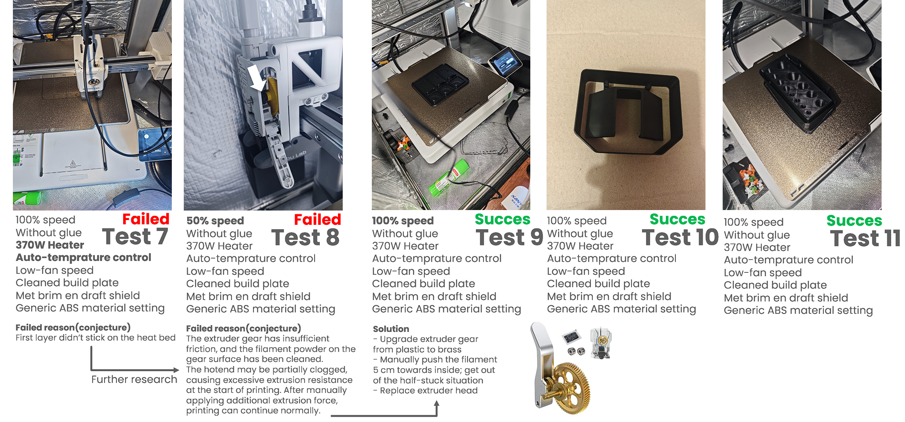

Settings:

- Speed: 100%

- Glue: None

- Heater: 370W

- Temperature control: Automatic

- Fan speed: Low

- Build plate: Cleaned

- Brim and draft shield: Enabled

- Material profile: Generic ABS

During this test, the main failure mechanism became clearer.

### Failure analysis

Possible causes:

#### 1. Insufficient extruder grip

The extruder gear had insufficient friction.

Filament powder accumulated on the gear surface, reducing feeding reliability.

#### 2. Partial hotend clog

The hotend may have had increased extrusion resistance.

After manually applying additional force to the filament, extrusion recovered.

### Recovery method

The following procedure allowed printing to continue:

1. Push filament approximately 5 cm forward manually.

2. Break through the partially blocked section.

3. Resume normal extrusion.

A possible explanation:

High ambient temperature may soften the filament before it reaches the melt zone.

This reduces the stiffness of the filament and decreases the effective feeding force from the extruder gear.

## Test 10 & Test 11

Open Test 10 & Test 11 details

## Test 10

Settings:

- Speed: 100%

- Glue: None

- Heater: 370W

- Temperature control: Automatic

- Fan speed: Low

- Build plate: Cleaned

- Brim and draft shield: Enabled

- Material profile: Generic ABS

## Test 11

Date:

2026-04-29

Settings:

- Speed: 100%

- Glue: None

- Heater: 370W

- Temperature control: Automatic

- Fan speed: Low

- Build plate: Cleaned

- Brim and draft shield: Enabled

- Material profile: Generic ABS

From Test 9 onward, printing became stable and repeatable.

Total experiments:

**11 tests performed**

Result:

- First 8 tests failed

- Successful printing started from Test 9

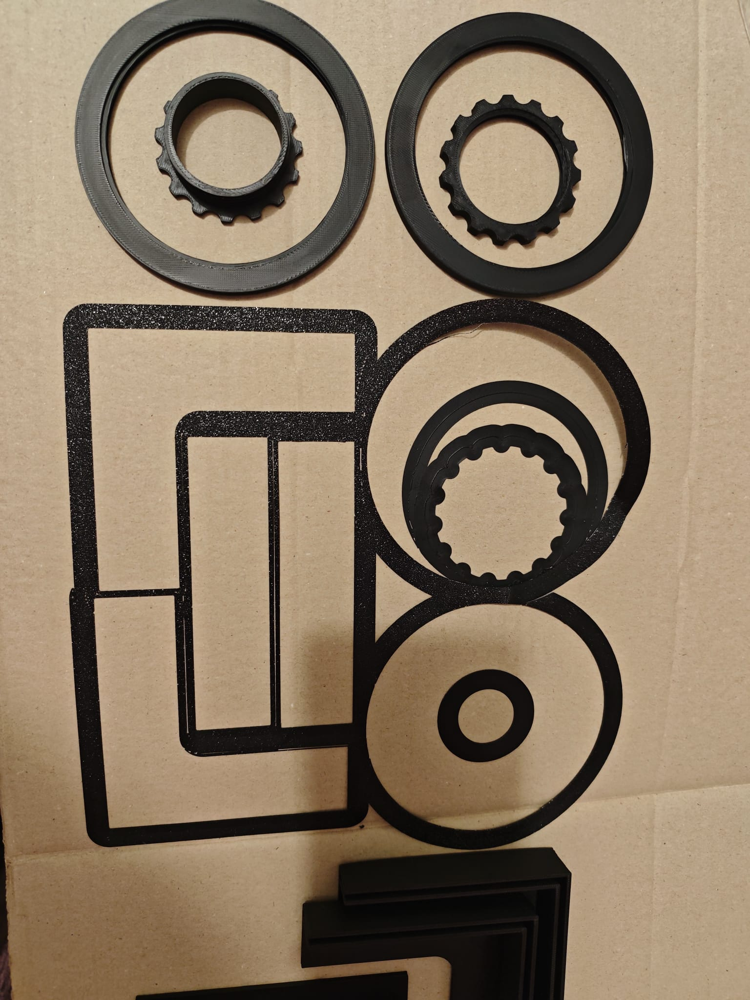

This represented the transition from unstable experimentation to a repeatable ABS printing process.

## Test 12-15 Update

Open Test 12-15 details

## Test conditions

Settings:

- Speed: 100%

- Glue: None

- Heater: Off

- Temperature control: Off

- Fan speed: Low

- Build plate: Cleaned

- Brim and draft shield: Only brim

- Material profile: Generic ABS

- Nozzle temperature:
  
  255°C → 260°C

These tests were less controlled because multiple variables were adjusted simultaneously.

The purpose was to evaluate the final printing behavior under simplified conditions.

The result showed:

- Slight edge warping

- No severe deformation

This suggests that the enclosure heating system may not always be required for smaller parts.

However, temperature control may still help reduce warping risk.

## Temperature optimization observation

A possible balance exists:

### Too cold

Problems:

- Higher shrink stress
- More warping
- Poor layer stability

### Too hot

Problems:

- Increased heat creep risk
- Filament softening before extrusion
- Higher chance of clogging

The ideal range may therefore be a compromise between:

- Thermal stability
- Extrusion reliability

## Clogging investigation

An important discovery was that clogging was not only related to high enclosure temperature.

Even at lower enclosure temperatures:

around 30°C

clogging could still occur.

This suggests that other factors also contribute:

- Hotend temperature
- Filament condition
- Extruder grip
- Mechanical resistance

Increasing nozzle temperature:

255°C → 260°C

reduced clogging frequency.

A slightly higher nozzle temperature improved material flow and reduced extrusion resistance.

## Final failure analysis

Tests 12–14 failed.

Success was achieved only during:

**Test 15**

The main cause was likely not enclosure temperature.

Instead:

### Extruder gear slipping

The stock extruder gear had insufficient grip.

During cold starts:

1. Filament cooled unevenly.

2. Resistance increased inside the extrusion path.

3. The extruder gear could not push enough force.

4. Filament grinding occurred.

5. Material could not reach the nozzle.

Temporary solution:

Manually applying downward force on the filament allowed the gear to overcome the resistance.

After extrusion recovered, the print continued normally.

Recommended improvement:

Replace the stock plastic gear with a hardened steel gear.

# Problems Encountered

## Cooling and thermal issues

Main issues:

- Ambient temperature below 45°C caused warping.

- Ambient temperature above 55°C increased overheating risk.

- High temperature could damage extruder cooling performance.

- Cooling fan speed was too high.

- Bed temperature was not always optimal.

- Cold airflow affected first layer adhesion.

- Enclosure temperature was unstable.

- Passive heat loss was too high.

## Extrusion and mechanical issues

Observed problems:

- Filament grinding

- Poor extruder gear grip

- Partial hotend clogging

- Heat creep

- Excessive extrusion resistance

- Possible wet filament

## Adhesion issues

Problems:

- First layer failure

- Glue did not always improve adhesion

- Build plate required better cleaning

# Possible Solutions

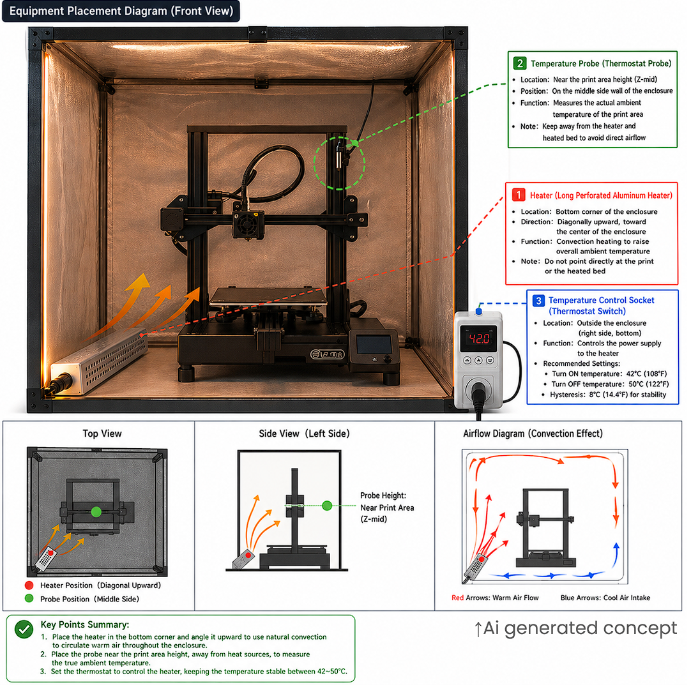

Several improvements were considered during the research.

# Hardware improvements

Possible upgrades:

- Replace hotend

- Improve enclosure insulation

- Upgrade build plate

- Add thermostat-controlled heating

- Upgrade extruder system

# Process improvements

Recommended adjustments:

- Clean build plate carefully

- Reduce cooling fan speed

- Use brim instead of large draft shield

- Tune printing speed according to material behavior

- Test ASA as an alternative engineering material

- Use higher quality ABS filament

# Extrusion reliability improvements

Recommended actions:

- Check extruder gear condition

- Remove filament dust from gear

- Clear partial hotend blockage

- Manually assist filament feeding when necessary

# Extruder Gear Discussion

One considered upgrade was replacing the original gear with a brass gear.

However, this may not necessarily be an improvement.

Because brass has higher thermal conductivity, it could transfer more heat into the filament path.

This may soften filament earlier and potentially increase extrusion problems.

Therefore, a hardened steel gear is considered a safer upgrade.

## 9. Future Work

Further testing could include:

- Comparing ABS with ASA under the same conditions
- Testing a higher-quality ABS filament brand
- Measuring the effect of different enclosure insulation levels
- Testing a more reliable thermostat-controlled heating setup
- Evaluating different build plate materials
- Refining extrusion recovery procedures
- Repeating identical models with controlled variables to improve repeatability

Future experiments should focus more on isolating individual variables instead of changing multiple parameters simultaneously.

## 10. Self Reflection

This study made me realize that ABS printing is not simply a matter of choosing the correct slicer settings.

Compared with PLA and PETG, ABS provides better heat resistance, durability and mechanical performance, but it requires a much more stable printing environment.

During this project, I learned that successful printing depends on the interaction between:

- Material properties
- Thermal environment
- Mechanical reliability
- Measurement accuracy
- Testing methodology

The early experiments were not perfectly controlled because several variables were changed at the same time. Although this accelerated troubleshooting, it made it more difficult to identify the exact cause of failures.

A more scientific approach would be:

- Change only one variable at a time
- Record environmental conditions
- Keep the test geometry identical
- Repeat successful conditions multiple times

Another important lesson was that measurements are only useful when the measurement method itself is reliable.

The initial temperature sensor position was not ideal, which caused misleading temperature readings. After repositioning the sensor closer to the printing area, the data became much more representative of the actual printing environment.

Overall, this project changed my understanding of 3D printing.

A failed print is not simply a failed result. It is a system feedback signal that can reveal problems in thermal control, mechanical design or process parameters.

## 11. Filament and Printer Setup

### Printer

- Printer: Bambu Lab A1
- Nozzle: Bambu Lab Stainless Steel 0.4mm
- Build plate: Bambu Lab PEI Build Plate

### Material

- Filament: ABS
- Diameter: 1.75mm

### Extrusion System

Original setup:

- Standard Bambu Lab extruder gear

Recommended improvement:

- Hardened steel extruder gear

The original gear showed insufficient grip under certain conditions, which could contribute to filament grinding and extrusion instability.

A full-metal brass gear was considered, but it may introduce additional heat transfer into the filament path. Therefore, it may not always be an improvement.

### Printing Environment

Room temperature:

18–24°C

Typical enclosure temperature:

48–56°C

Recommended working range:

45–50°C

Higher enclosure temperatures can improve warping resistance, but may increase the possibility of heat creep and extrusion problems.

## 12. References

1. Bambu Lab Basic Maintenance  
https://wiki.bambulab.com/en/a1/maintenance/basic-maintenance

2. Bambu Lab - What is Heat Creep?  
https://wiki.bambulab.com/zh/filament-acc/filament/heat-creep

