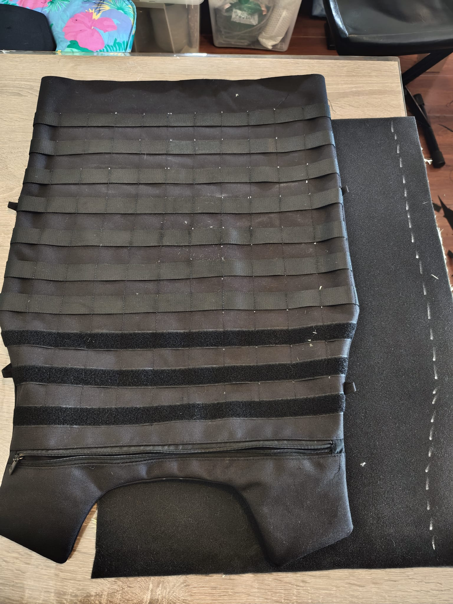
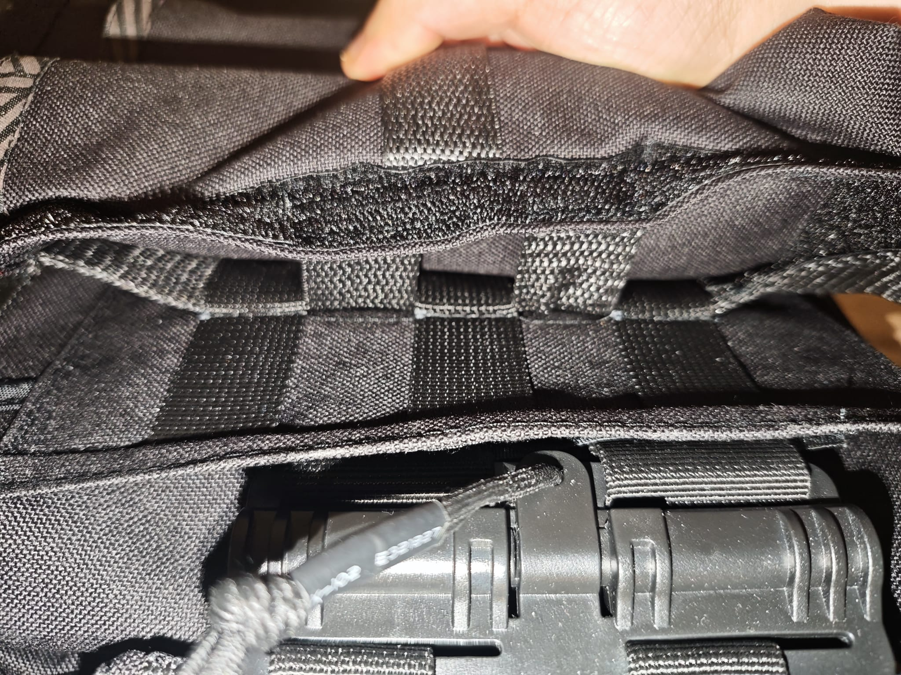
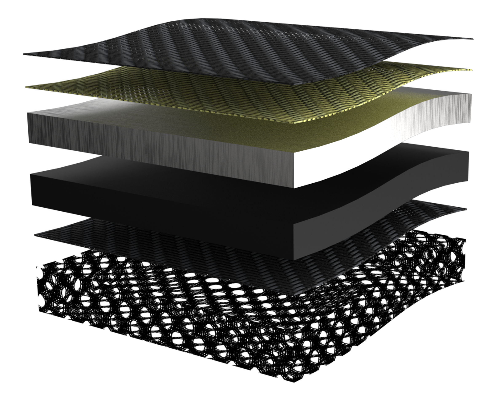

# Background & Research

This project began with a straightforward question: how is heavy-duty tactical protective gear actually constructed? Rather than treating the vest as a black-box product, I wanted to understand every layer — from the fabric selection logic to the stitching techniques that hold high-performance composite materials together under stress.

Protective vests used in industrial and tactical settings must balance conflicting demands. They need to stop projectiles, resist abrasion, manage heat, and remain wearable for extended periods — all while maintaining enough modularity to adapt to different mission profiles. The market offers a wide range of solutions, from military-grade plate carriers to lightweight industrial safety vests, but few resources explain the _why_ behind each design decision.

My research focused on three areas:

- **Market analysis** of existing plate carrier designs (Crye Precision, Spiritus Systems, Ferro Concepts) to understand modular architecture
- **Material properties** of technical textiles used in ballistic protection
- **Construction methods** for heavy fabrics and composite material stacks

The insight that emerged was that protective gear is fundamentally a layered system — each material layer addresses a specific threat type, and the ordering of layers is just as critical as the materials themselves.

# Requirements Definition

Before purchasing materials or cutting fabric, I defined a clear set of functional requirements the system needed to satisfy:

| Requirement            | Target                                 | Rationale                                           |
| ---------------------- | -------------------------------------- | --------------------------------------------------- |
| Flame resistance       | Outer layer self-extinguishing         | Protection against welding sparks and hot particles |
| Cut resistance         | Kevlar layer for blade/shard defense   | Common risk from metal splinters and tool fragments |
| Penetration resistance | Hard plate for high-velocity fragments | Protection against fast-moving debris and impact    |
| Impact absorption      | 10mm trauma pad                        | Blunt force trauma mitigation                       |
| Modular expandability  | Full MOLLE grid integration            | Pouch and accessory attachment                      |
| Adjustable fit         | Hook-and-loop at shoulders and waist   | Accommodating different body types and layering     |
| Breathability          | 3D mesh air channels                   | Extended wear comfort and heat management           |
| Total thickness        | ~40mm calibrated stack                 | Balance between protection and mobility             |

The key design philosophy was **risk-oriented layering**: instead of attempting to protect against all possible threats simultaneously (which would produce an unwearable product), each layer targets a specific, commonly encountered hazard. This approach mirrors how professional protective equipment is designed — not as a universal shield, but as a configurable system optimized for real-world work scenarios.

# Material Selection

Every material in the vest was chosen for a specific protective function. The layering follows a clear logic: environmental protection on the outside, ballistic protection in the middle, and comfort on the inside.

## Layer Breakdown (Outside to Inside)

| Layer               | Material                | Thickness       | Function                                                                                                                                                                                              |
| ------------------- | ----------------------- | --------------- | ----------------------------------------------------------------------------------------------------------------------------------------------------------------------------------------------------- |
| **Outer Carrier**   | 1000D Oxford Nylon      | 0.5–1mm         | Flame retardant, waterproof, abrasion resistant, tear resistant. Shields inner layers from UV, moisture, and mechanical wear.                                                                         |
| **Soft Protection** | Kevlar (Aramid)         | 0.3–0.5mm/layer | Scratch resistant, fire resistant, cut resistant. Protection against low-velocity fragments. Placed inside the outer carrier to avoid direct UV exposure which degrades aramid performance over time. |
| **Hard Protection** | Steel Alloy Plate       | 8mm             | Protection against high-velocity fragments, puncture resistant, impact resistant. Provides rigid structural defense against penetrating threats.                                                      |
| **Trauma Pad**      | Ventilated PU Foam      | 10mm            | Energy absorbing, shock absorbing, blunt impact protection. Lightweight cushioning that distributes impact force across a wider area to reduce blunt trauma.                                          |
| **Inner Carrier**   | 1000D Oxford Nylon      | 0.5–1mm         | Same durable shell fabric. Encapsulates the protective layers and provides the base for the ergonomic backer.                                                                                         |
| **Ergonomic Layer** | 3D Micro-mesh Air Ducts | —               | Ventilation, breathability, moisture wicking. Reduces heat buildup during extended wear by creating air channels between the body and the armor.                                                      |

# Design & Prototyping

## Pattern Making and Construction

The production process began with estimating the required fabric quantity based on body measurements, followed by material procurement and precision cutting. All patterns were drafted on paper, transferred to fabric, and refined through multiple fitting iterations.

**Key construction elements:**

- <strong style="color:var(--accent)">Industrial sewing techniques</strong>: Working with 1000D Oxford Nylon required heavy-duty needles and adjusted machine tension. The fabric's density means standard domestic machines cannot penetrate multiple layers — an industrial walking-foot machine was essential.
- <strong style="color:var(--accent)">Kevlar handling</strong>: Aramid fabric cannot be cut with standard scissors. It requires specialized industrial shears with serrated blades. The material's tendency to fray at edges demanded careful seam allowance planning.
- <strong style="color:var(--accent)">MOLLE webbing system</strong>: The PALS (Pouch Attachment Ladder System) grid was sewn with precise 1-inch spacing, reinforced with bartack stitches at each attachment point. This standardizes compatibility with a wide range of pouches and accessories.
- <strong style="color:var(--accent)">Adjustable fasteners</strong>: Hook-and-loop panels at the shoulder straps and cummerbund allow the vest to adapt to different body types and clothing layers. This modular approach supports future expandability without requiring complete reconstruction.

## Modular System Architecture

The design incorporates modularity at two levels:

1. <strong style="color:var(--accent)">Wearer-facing adjustability</strong>: Hook-and-loop closures at connection points (shoulders and sides) for size adjustment
2. <strong style="color:var(--accent)">Mission-facing expandability</strong>: MOLLE grid across the front, back, and cummerbund for attaching pouches, hydration carriers, admin panels, and other accessories

# Testing & Validation

Testing focused on fit, material compatibility, and production feasibility:

- <strong style="color:var(--accent)">Fit testing</strong>: Multiple wear sessions to evaluate range of motion, pressure points, and adjustment range
- <strong style="color:var(--accent)">Material compatibility</strong>: Verifying that layered materials did not cause unexpected wear against each other (e.g., Kevlar abrasion against nylon)
- <strong style="color:var(--accent)">Stitch integrity</strong>: Load-testing bartack reinforcements at MOLLE attachment points
- <strong style="color:var(--accent)">Production challenges</strong>: The most significant challenge was managing material thickness at seam intersections — some join points accumulated 6–8 layers of heavy fabric, requiring careful seam grading and specialized presser feet

# Functional Layers Cross-Section

  

    
  

  

    <h3>Layer 1 — Carrier</h3>
    
1000D Oxford Nylon (0.5–1 mm)

    <h3>Layer 2 — Soft Protection</h3>
    
Kevlar (0.3–0.5 mm per layer)

    <h3>Layer 3 — Hard Protection</h3>
    
Steel Alloy Plate (8 mm)

    <h3>Layer 4 — Trauma Pad</h3>
    
Ventilated PU Foam (10 mm)

    <h3>Layer 5 — Inner Carrier &amp; 3D Cooling Pad</h3>
    
1000D Oxford Nylon + 3D Micro-mesh Air Ducts

  

# Result & Reflection

This project was fundamentally a deep dive into **how clothing — specifically high-performance protective clothing — is engineered from raw materials to finished product.**

## What I Learned

- <strong style="color:var(--accent)">Systematic garment construction</strong>: From pattern drafting through cutting, assembly, and finishing, I gained hands-on understanding of the complete textile production workflow
- <strong style="color:var(--accent)">Heavy fabric handling</strong>: Working with 1000D Oxford Nylon taught me how industrial machines and specialized needles handle materials that domestic equipment cannot penetrate
- <strong style="color:var(--accent)">Special material processing</strong>: Kevlar requires specific cutting tools and techniques — standard scissors are useless; industrial serrated shears are mandatory
- <strong style="color:var(--accent)">Modular design thinking</strong>: The MOLLE system is a case study in standardized modularity — every stitch and spacing decision affects compatibility with an entire ecosystem of accessories
- <strong style="color:var(--accent)">Material-property-driven design</strong>: Understanding how material choice directly connects to the requirements of the intended use scenario is the core competency of industrial design applied to soft goods

The project transformed my understanding of an everyday object category. Protective vests are not just "heavy clothing" — they are engineered systems where material science, human factors, and manufacturing constraints intersect at every seam.
