# Overview

This is a structured log of my self-study journey into hardware fundamentals and analog electronics. The material starts from the very basics of voltage and current theory, then progresses into component-level circuit design — covering resistors, capacitors, inductors, diodes, transistors, and power supply topologies.

> **Note:** The images used are for educational and self-study purposes only.

# Voltage and Current

## Simple Explanation — The Water Analogy

To build an intuitive understanding, let's use a water pipe analogy:

- **Voltage (V):** Equivalent to **water pressure** — the potential energy difference that pushes electric charges through a circuit
- **Current (I):** Equivalent to **water flow rate (velocity)** — the actual movement of electric charges inside the conductor
- **Resistance (R):** Equivalent to **pipe thickness** — a narrower pipe provides greater resistance to the flow of water

> **Ohm's Law:** V = I × R

## Complex Explanation

When we flip a switch, the light bulb turns on instantly. Do electrons rush from the battery to the bulb at the speed of light? **Not at all.**

### "Snail-paced" Electrons vs. "Light-speed" Energy Propagation

Inside metallic conductors (like copper wires), free electrons form what is known as an **"electron sea"**.

- **Drift Velocity:** When a circuit is powered, electrons move forward under the drive of electric field forces. However, because they constantly collide with the crystalline lattice of copper atoms, their net movement speed is incredibly slow — typically only **a few micrometers to millimeters per second** (slower than a snail).
- **Establishment of the Electromagnetic Field:** If electrons move so slowly, why does the light bulb turn on instantly? Because what truly transmits energy is not the electrons themselves, but the **electromagnetic field**. The moment the switch is closed, an electric field is established around the wire at **nearly the speed of light** (approx. 3 × 10⁸ m/s).
- **The Physical Reality:** Free electrons already exist throughout the entire wire. Once the electric field is established, all electrons along the line receive the command of the electric field force (F = qE) at almost the same instant and start moving together.

### The Essence of Voltage: Spatial Accumulation of Electric Field Force

In physics, the essence of voltage is the **electrical potential difference**. The role of a battery or power source is to forcefully separate positive and negative charges using chemical or magnetic energy, thereby creating an **electric field** in space. Voltage is defined as the work done by the electric field force per unit charge as it moves between two points.

Thus, voltage is not some invisible gas pressure, but rather the **spatial accumulation of an "invisible push" exerted by the electric field on electric charges**.

# Kirchhoff's Laws

These two laws are specific manifestations of the universe's fundamental physical laws — **conservation of charge** and **conservation of energy** — within an electrical circuit.

## Kirchhoff's Current Law (KCL) — Why Electrons Cannot Pile Up

- **Macroscopic Formula:** Σ I_in = Σ I_out
- **Microscopic Physics:** Electrons carry negative charges. According to **Coulomb's Law**, there is an immensely powerful repulsive force between like charges. If more electrons flow into a junction than flow out, negative charge would rapidly accumulate at that node.
- **Self-Regulating Mechanism:** The moment negative charge begins to accumulate, the powerful repulsive force instantly "pushes away" incoming electrons while "speeding up" outgoing electrons. This microscopic self-balancing process finishes within nanoseconds. Under steady-state conditions, **no node can hold excess net charge**; whatever current goes in must come out.

## Kirchhoff's Voltage Law (KVL) — Why a Full Loop Must Equal Zero

- **Macroscopic Formula:** Σ V = 0
- **Microscopic Physics:** In electrostatics or low-frequency circuits, the electric field is a **conservative field (irrotational)**. The work done by the electric field force depends only on the starting and ending positions, independent of the path taken.

- **Energy Conservation Analogy:** A power source acts like a "charge elevator," consuming chemical energy to lift electrons from a lower potential to a higher potential. As electrons flow through a resistor, the potential energy gained is entirely converted into **thermal energy** or **light energy** through collisions with the atomic lattice. Energy cannot be created out of nothing, nor can it vanish — this is the ultimate truth behind KVL.

# Basic Electrical Components

## Resistor

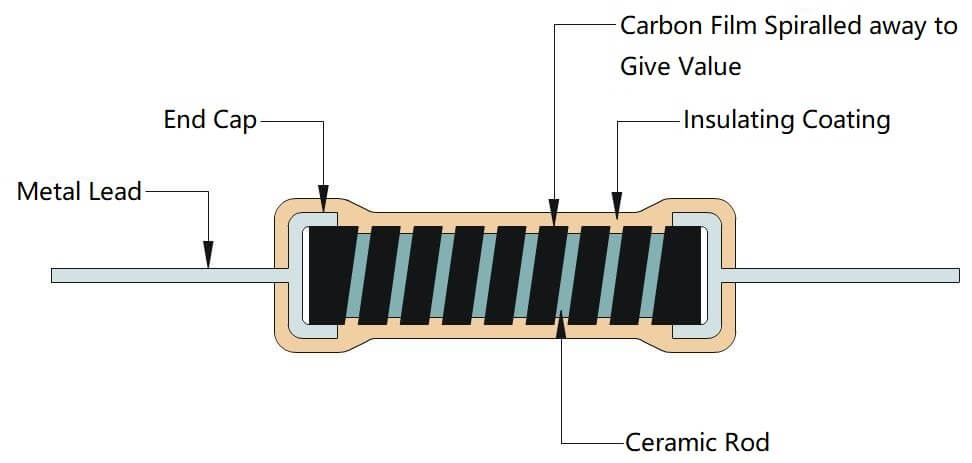

A resistor is a passive electronic component designed to create resistance in the flow of electric current. Its primary jobs are to limit current (to keep components like LEDs from burning out) and to divide voltage.

### Internal Structure — Carbon Film Resistor

1. **The Ceramic Core:** A solid rod of high-grade ceramic (insulator) serving as the structural base
2. **The Carbon Film Layer:** A thin layer of pure carbon deposited around the ceramic rod — this is the resistive material
3. **The Helical Groove:** Shorter, wider spiral path = Lower resistance; Longer, thinner spiral path = Higher resistance
4. **End Caps and Leads:** Metal end caps pressed onto both sides of the rod with tinned copper leads welded to them
5. **Protective Coating & Color Bands:** Insulating lacquer coating with colored stripes to indicate resistance value and tolerance

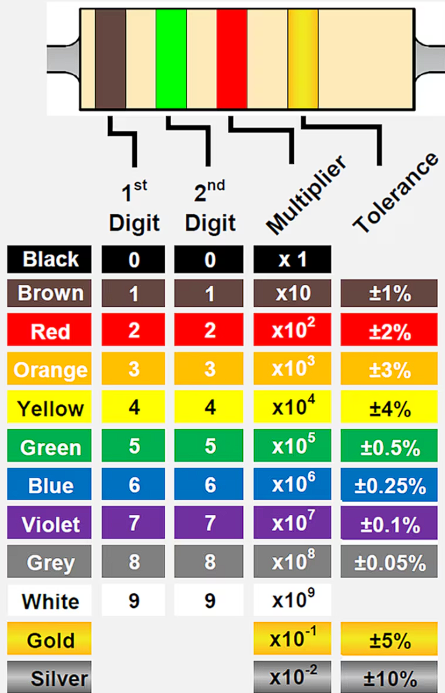

### LED Current Limiting

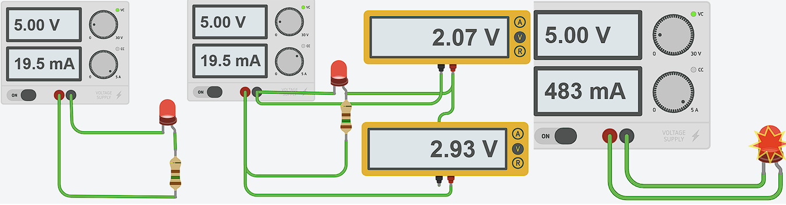

### Theory: Voltage Division Principle

In a series circuit with multiple resistors, the voltage drop is proportional to the resistance (R↑ = V↑).

**Calculating the Series Resistor (Voltage Drop):**
Scenario: An LED operates at 3V and draws 13.5mA (0.0135A) of current with a 5V power source.

- V_drop = V_source - V_LED = 2V
- R = V_drop / I = 2V / 0.0135A = 148.15 ohms → **150 ohm resistor**

### LED as Resistance?

An LED cannot be treated as a fixed ohmic resistor because it is a non-linear component. While a standard resistor follows Ohm's law, an LED is a diode with a non-linear current-voltage curve.

### Practical Case: Voltage Comparator

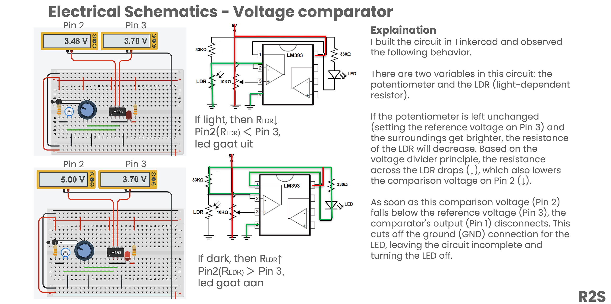
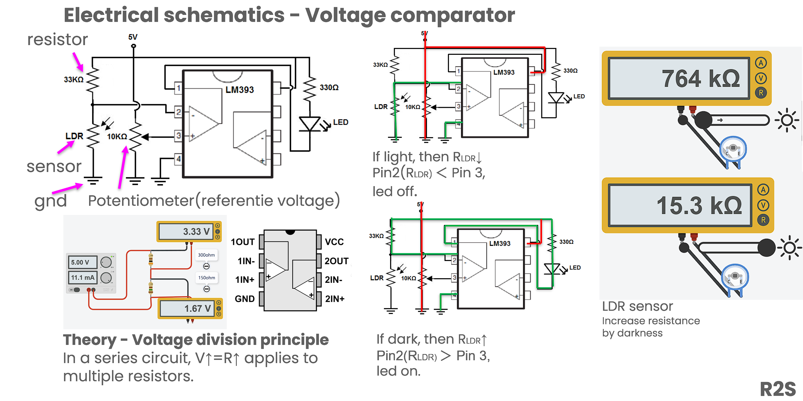

### Resistor — Types

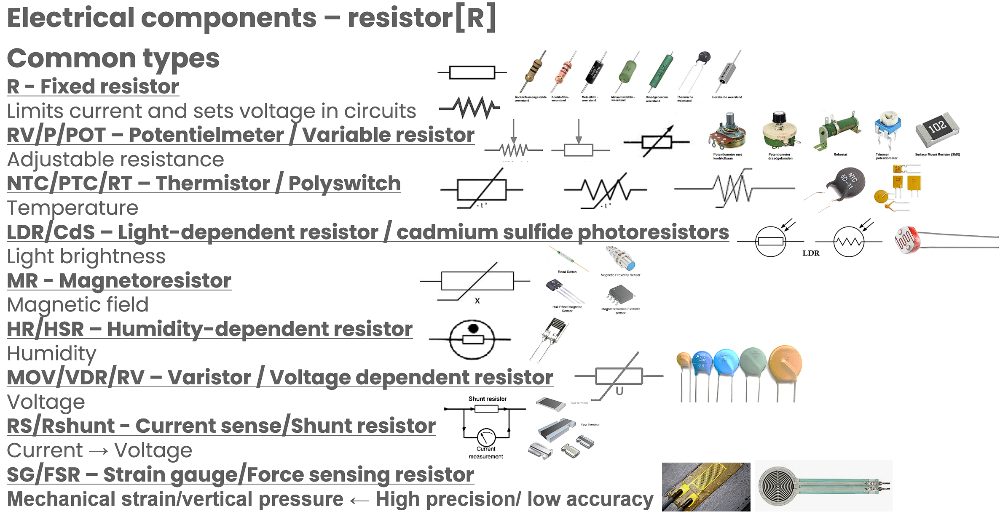

Various types of resistors are used in electronic circuits, each with different construction, characteristics, and applications. Common types include carbon film, metal film, wire-wound, SMD chip resistors, and variable resistors (potentiometers). The choice depends on factors such as power rating, tolerance, temperature coefficient, and noise requirements.

### Resistor — Conclusion

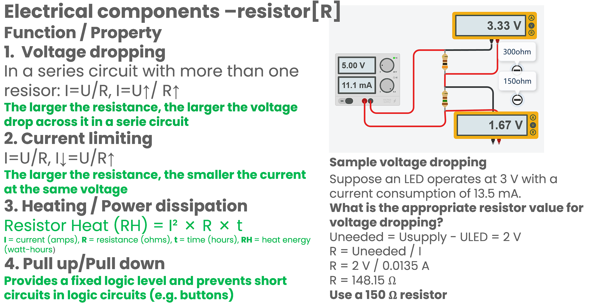

## Capacitor

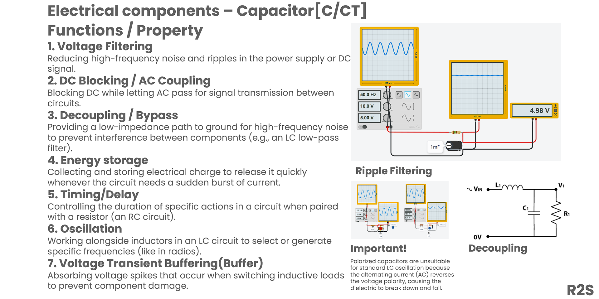
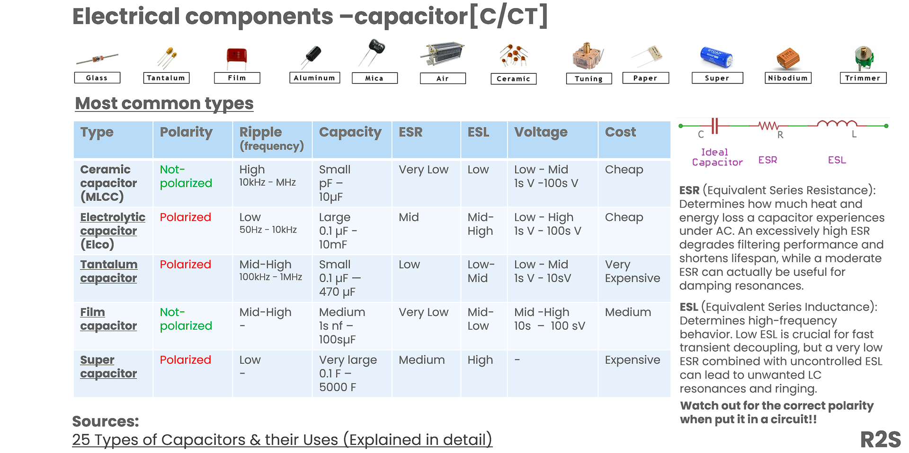

Capacitors store energy in an electric field between two conductive plates separated by a dielectric. They are used for filtering, decoupling, timing circuits, and energy storage.

## Inductor

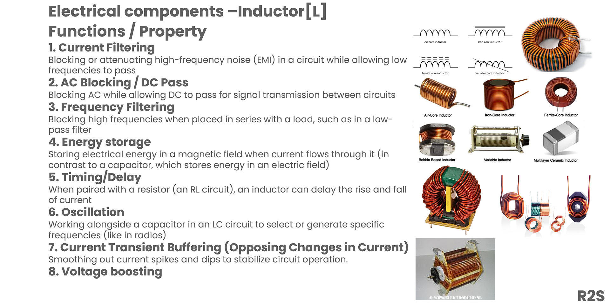

An inductor is a passive electronic component that stores energy in a magnetic field when current flows through it. It consists of a coil of wire, often wound around a magnetic core. The key property of an inductor is its ability to resist changes in current — it smooths out current fluctuations and opposes sudden changes.

### Practical Case: Rectifier Bridge with LC Filter

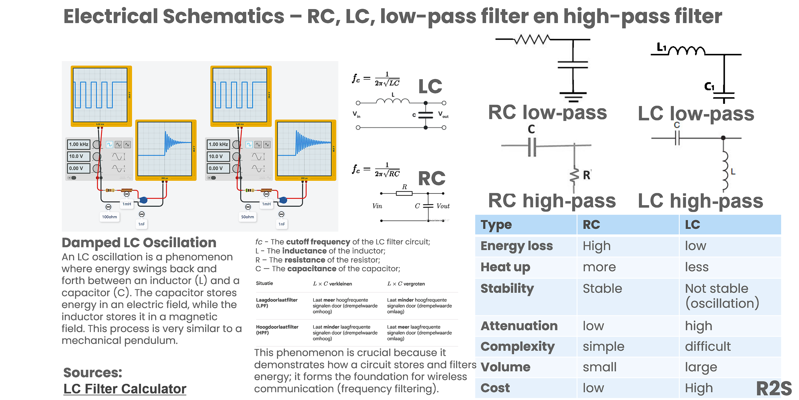
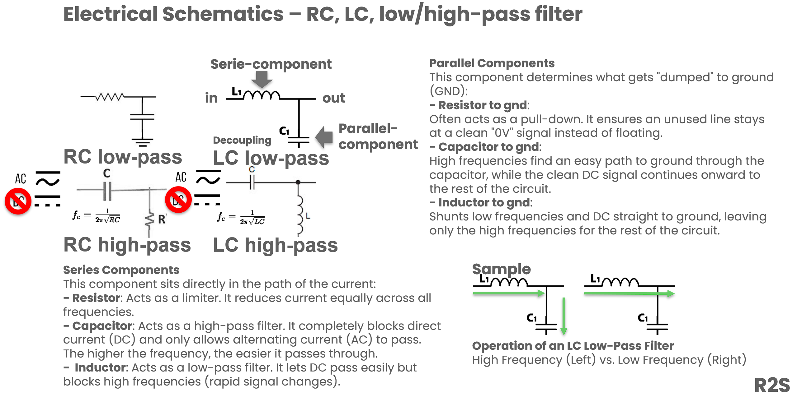

In power supply circuits, inductors are used in combination with capacitors to form LC filters. After the bridge rectifier converts AC to pulsating DC, the inductor helps smooth the output by opposing ripple current, resulting in a cleaner DC voltage.

## Diode

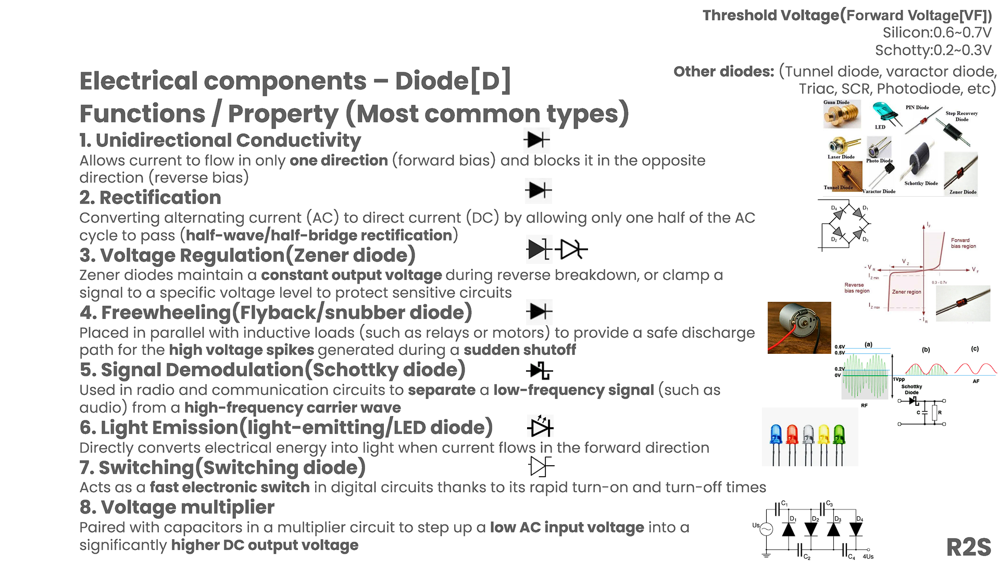

A diode is a semiconductor device that allows current to flow in only one direction — from anode to cathode. It is the fundamental building block for rectification, protection, and signal processing.

### Practical Case: Rectifier Bridge

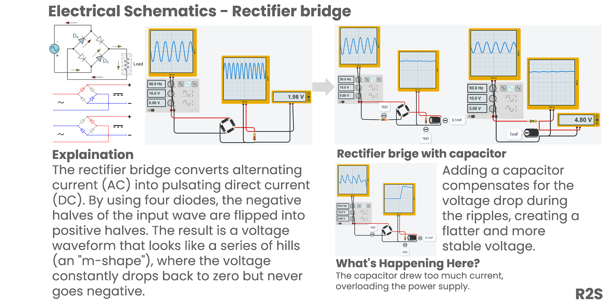

## Transistor

🚧 *UPCOMING — Content on transistors will be added in a future update.*

## MOSFET

🚧 *UPCOMING — Content on MOSFETs will be added in a future update.*

## Linear and Switching Power Supply

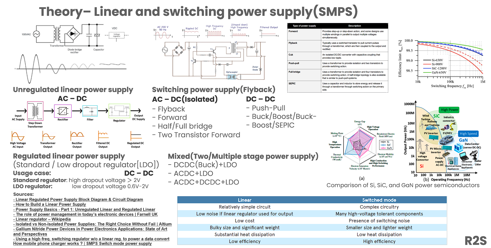

Power supplies convert input power into regulated DC output. The two main topologies are:

- **Linear Power Supply:** Uses a transformer, rectifier, filter capacitor, and linear regulator. Simple, low noise, but inefficient (excess energy dissipated as heat).
- **Switching Power Supply (SMPS):** Uses high-frequency switching, a transformer, and feedback control. More complex but highly efficient and compact.

### Practical Case: 230V → 12V Switching Power Supply

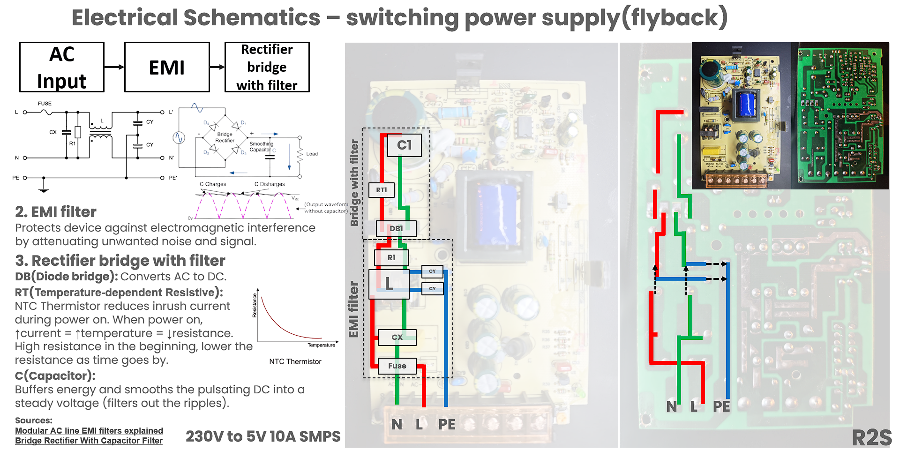
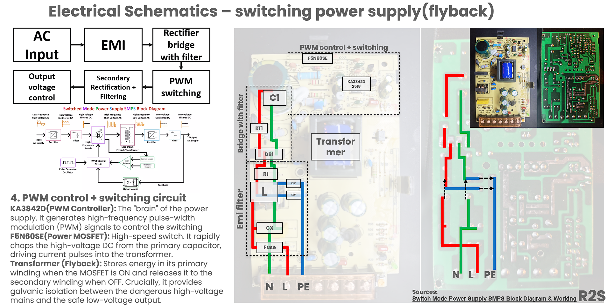
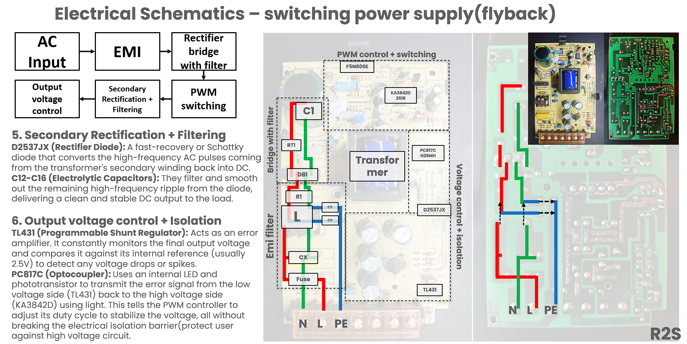

## Practical Skills

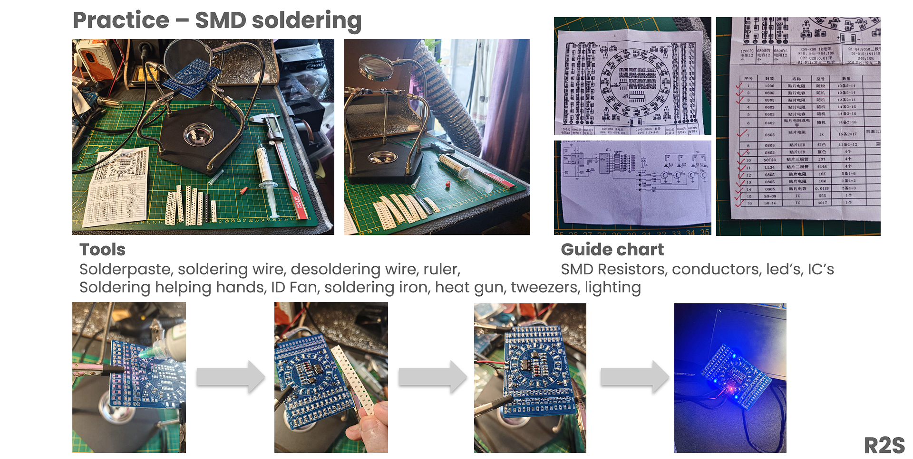

Hands-on skills covered include breadboarding, soldering, using a multimeter, reading schematics, and basic troubleshooting techniques.

# References

1. [LED weerstand calculator](https://www.budgetronics.eu/nl/led-weerstand-calculator/c-7)
2. [Resistor Heat Calculator](https://a2zcalculators.com/science-and-engineering-calculators/resistor-heat-calculator)
3. [Pull-up and Pull-down Resistors](https://www.circuitbasics.com/pull-up-and-pull-down-resistors/)
4. [Voltage comparator LM393 data sheet | TI.com](https://www.ti.com/product/LM393#features)
5. [How to Build a Voltage Comparator Circuit Using an LM393](https://www.learningaboutelectronics.com/Articles/LM393-voltage-comparator-circuit.php)
6. [LC filter calculator](https://www.omnicalculator.com/physics/lc-filter)
7. [Voltage and Current Explained](https://www.ariat-tech.com/blog/comprehensive-overview-of-voltage-and-current.html)
8. [25 Types of Capacitors & their Uses](https://www.etechnophiles.com/types-of-capacitors/)
9. [Linear Regulated Power Supply Block Diagram & Circuit Diagram](https://www.hackatronic.com/linear-regulated-power-supply-block-diagram-circuit-diagram/)
10. [How to Build a Linear Power Supply](https://www.circuitbasics.com/linear-power-supplies/)
11. [Power Supply Basics — Part 1](https://mcitransformer.com/power-supply-basics-part-1-unregulated-linear-regulated-linear/)
12. [Isolated vs Non-Isolated Power Supplies](https://resources.altium.com/p/isolated-vs-non-isolated-power-supplies-right-choice-without-fail)
13. [Gallium Nitride Power Devices in Power Electronics Applications](https://www.mdpi.com/1996-1073/16/9/3894)
14. [How mobile phone charger works? | SMPS](https://www.youtube.com/watch?v=F2dCS5qOE8A)
15. [Modular AC line EMI filters explained](https://passive-components.eu/modular-ac-line-emi-filters-explained/)
16. [Bridge Rectifier With Capacitor Filter](https://www.voltagelab.com/bridge-rectifier-with-capacitor-filter/)
17. [Understanding of Carbon Film Resistors](https://www.utmel.com/blog/categories/resistor/understanding-of-carbon-film-resistors)
18. [Resistor Color Codes: What Do the Color Bands Mean?](https://www.te.com/en/products/passive-components/resistors/intersection/resistor-color-codes.html)
