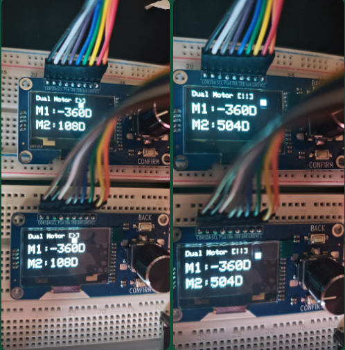
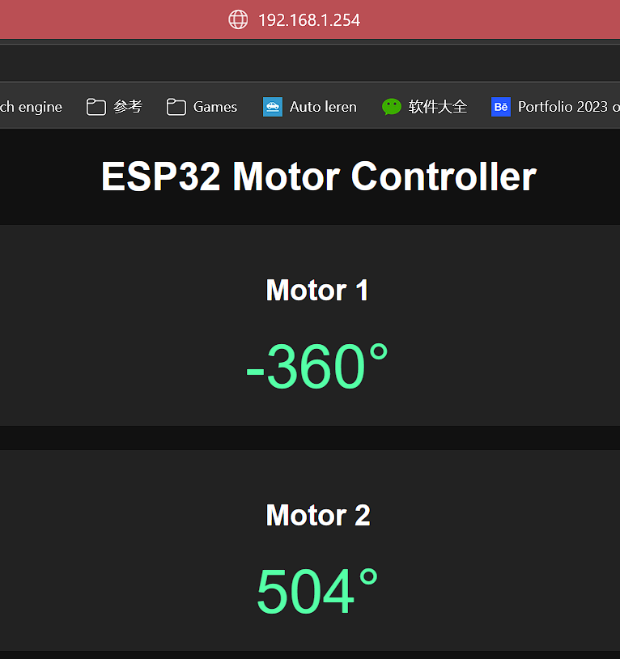

# 目的

验证 ESP32 能否同时处理：

1. **双 EC11 旋转编码器输入**——正/反转检测、增量计数、按键输入
2. **SH1106 OLED 显示**——实时显示两路编码器角度，I2C 通信稳定性
3. **WiFi WebSocket 服务器**——浏览器实时角度显示，自动重连
4. **FreeRTOS 多任务架构**——编码器任务 (1000 Hz)、电机任务 (100 Hz)、OLED 任务 (10 Hz)、WebServer

# 系统架构

```
                 ESP32
            ┌───────────────┐
 Core 0     │ WebServer     │
            │ WebSocket     │
            └───────────────┘
            ┌───────────────┐
 Core 1     │ Encoder Task  │ 1000 Hz
            │ Motor Task    │  100 Hz
            │ OLED Task     │   10 Hz
            └───────────────┘
```

# 引脚定义

## 模块 1 — 编码器 + OLED

| 信号 | ESP32 引脚 | 功能 |
|------|-----------|------|
| SDA  | GPIO21    | I²C 数据 |
| SCL  | GPIO22    | I²C 时钟 |
| VCC  | 3.3V      | 供电 |
| GND  | GND       | 接地 |
| TRA  | GPIO32    | 编码器 A（旋转） |
| TRB  | GPIO33    | 编码器 B（旋转） |
| PSH  | GPIO25    | 按压按钮 |
| BAK  | GPIO26    | 返回按钮 |
| CON  | GPIO27    | 确认按钮 |

## 模块 2 — 编码器 + OLED

| 信号 | ESP32 引脚 | 功能 |
|------|-----------|------|
| SDA  | GPIO21    | I²C 数据（共享总线） |
| SCL  | GPIO22    | I²C 时钟（共享总线） |
| VCC  | 3.3V      | 供电 |
| GND  | GND       | 接地 |
| TRA  | GPIO16    | 编码器 A（旋转） |
| TRB  | GPIO17    | 编码器 B（旋转） |
| PSH  | GPIO18    | 按压按钮 |
| BAK  | GPIO19    | 返回按钮 |
| CON  | GPIO23    | 确认按钮 |

> 两个 OLED 模块共享同一 I²C 总线（GPIO21/22）。每个模块的按钮和编码器使用独立 GPIO。

# 网页界面



浏览器通过 WebSocket 连接，实时显示两个编码器角度。心跳包维持连接，断线自动重连。

# OLED 显示

OLED 屏幕显示：
- 当前模式（动画运行/暂停）
- 动画指示条
- Motor 1 角度
- Motor 2 角度

# 结果

ESP32 成功：
- ✅ 读取双 EC11 编码器并识别方向
- ✅ SH1106 OLED 实时数据显示
- ✅ 创建 WiFi WebSocket 服务器
- ✅ 实时推送角度数据至浏览器
- ✅ FreeRTOS 多任务并行运行

验证了 ESP32 作为未来电机交互控制核心的可行性。
