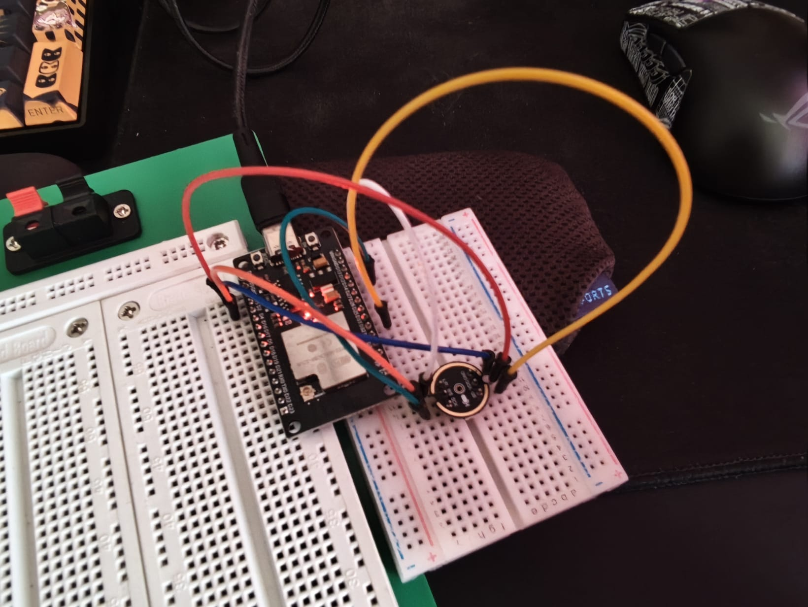
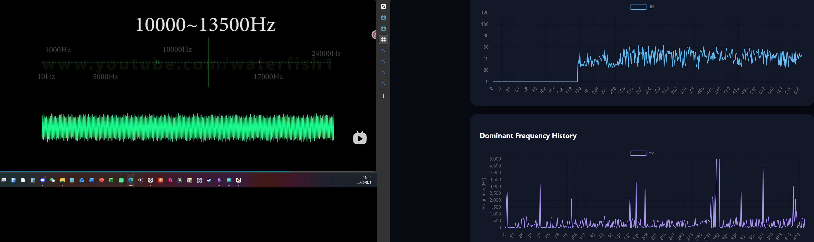
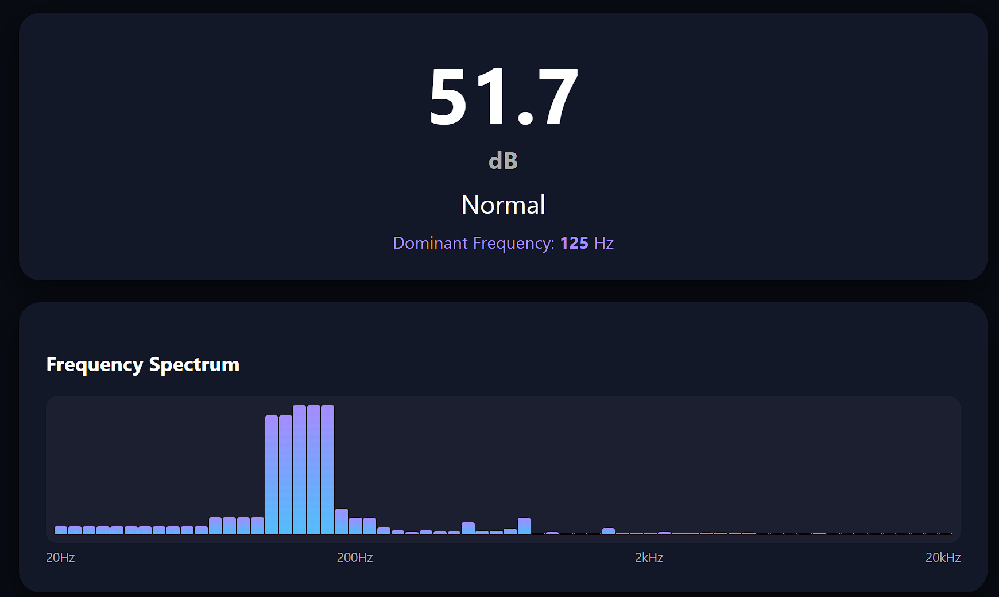

# 概述

使用 ESP32 与 INMP441 全向 I2S 麦克风搭建实时环境噪音监测器。系统采集音频数据、执行 FFT 频谱分析，并通过 WiFi 将实时数据推送到网页仪表盘——包含 dB 表、频谱柱状图与历史曲线。

# 系统架构

```
INMP441 → I2S → ESP32 → FFT → WebSocket → 浏览器仪表盘
                                  │
                          频谱 + dB + 历史数据
```

# 引脚 — INMP441 → ESP32

| INMP441 引脚 | ESP32 引脚 | 功能 |
|-------------|-----------|------|
| VDD         | 3.3V      | 供电 |
| GND         | GND       | 接地 |
| SD          | GPIO32    | I2S 串行数据 |
| WS          | GPIO15    | I2S 字选（LRCLK） |
| SCK         | GPIO14    | I2S 串行时钟 |
| L/R         | GND       | 左声道（接 GND） |

# 核心功能

- **实时 dB 读数**，带状态指示（安静 / 正常 / 警告 / 危险）
- **64 段频率频谱**，以动态柱状图呈现
- **主导频率检测**——实时识别当前最响的频率
- **噪音历史**，30 分钟滚动缓冲区（每秒 1 个采样点）
- **校准偏移**，可调节灵敏度

# 网页仪表盘




浏览器仪表盘使用 Chart.js 实现：
- 实时 dB 历史折线图
- 主导频率历史曲线
- 64 段动态频谱柱状图

# 代码结构

两个文件：
- **Main.ino** — I2S 驱动、FFT 处理、WiFi 服务器、JSON API
- **webpage.h** — 完整 HTML/CSS/JS 仪表盘，含 Chart.js 和 WebSocket 自动重连

# 结果

ESP32 成功通过 INMP441 采集音频、实时计算 FFT，并通过 WiFi 向多个浏览器客户端推送频谱和 dB 数据。仪表盘以 1 Hz 频率更新，图表动画流畅。
