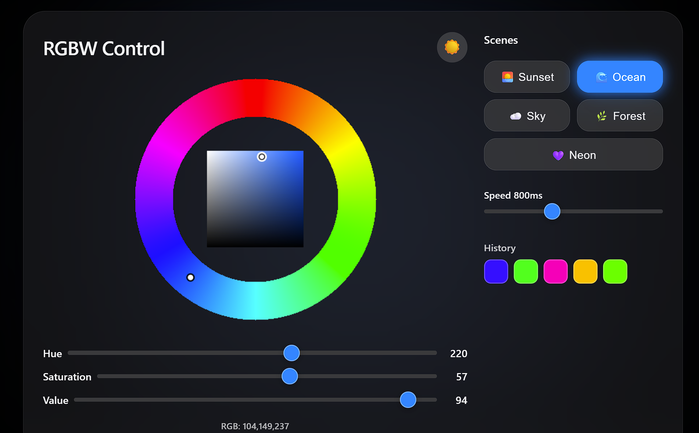
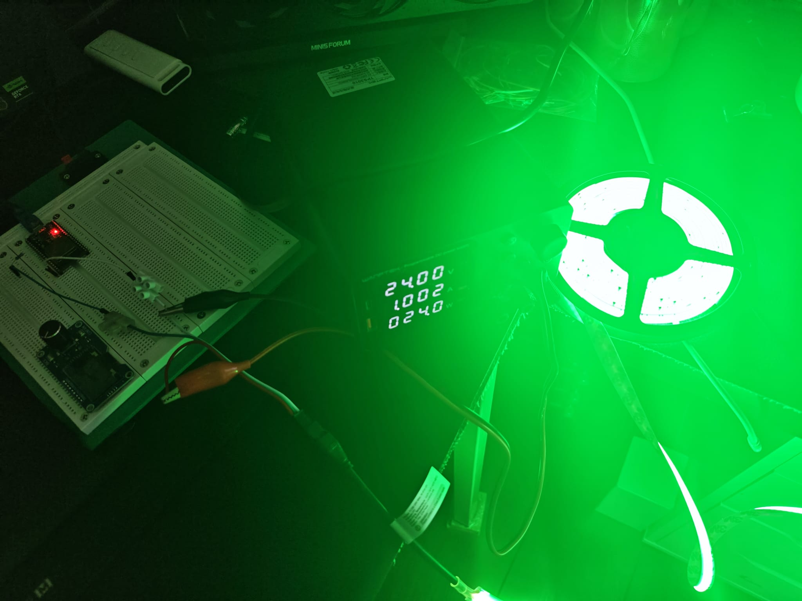
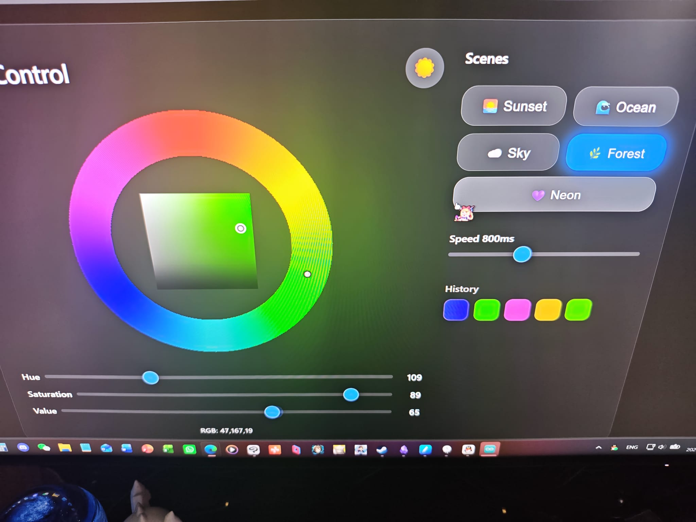

# 概述

在 ESP32 上搭建 WiFi 网页服务器，提供色环取色器和 RGB 滑块，实时控制 RGBWW FCOB LED 灯带。通过 RGB→RGBW 提取算法，将白光通道从 RGB 值中分离，实现精准混色。

# 颜色处理——RGB 转 RGBW

RGBWW 灯带的关键在于提取白光分量：

```cpp
void updateLED() {
    byte W = min(R, min(G, B));   // 白光 = 三通道共同分量
    byte r = R - W;                // 纯红
    byte g = G - W;                // 纯绿
    byte b = B - W;                // 纯蓝

    for (int i = 0; i < LED_COUNT; i++) {
        strip.SetPixelColor(i, RgbwColor(r, W, g, b));
    }
    strip.Show();
}
```

> **注意：** NeoGrbwFeature 的通道顺序为 **红、白、绿、蓝**——并非通常的 R、G、B、W。

# 网页界面




网页提供：
- 色环直观选色
- R、G、B 独立滑块精细调节
- LED 颜色实时预览

# 结果

ESP32 成功提供响应式颜色控制页面。用户可通过色环或独立通道调节颜色，FCOB 灯带即时响应。RGB→RGBW 算法输出色彩干净，暖白通道可独立控制。
