# The Problem I Was Trying to Solve

Here's something that happens all the time in product design: you're picking a translucent material for a lamp shade, a diffuser panel, or a display cover, and you're basically making an educated guess. You hold the sample up to the light, squint a bit, maybe hold it next to another sample, and think "yeah, this one looks about right."

The trouble is, two materials that look identical under room light can behave completely differently once they're backlit. Surface finish, thickness, pigment load, internal structure — they all affect how light moves through the material, and renderings can only get you so far. At some point you need to actually measure what's happening.

So I built a test rig. Not because I wanted to spend weeks on an apparatus, but because every CMF decision I made after that would be backed by data instead of intuition.

# What the Platform Measures

Four optical properties, each directly relevant to product design decisions:

| Property                   | What It Tells You                                   | Why It Matters for Design                                |
| -------------------------- | --------------------------------------------------- | -------------------------------------------------------- |
| **Transmission**           | How much light gets through the material            | Brightness of backlit displays, LED indicator visibility |
| **Diffusion**              | How evenly the light scatters after passing through | Hotspot elimination, uniformity of illuminated surfaces  |
| **Reflection**             | How the material surface bounces incident light     | Surface finish selection, glare management               |
| **Luminance Distribution** | Brightness variation across the illuminated area    | Visual comfort, light guide performance                  |

Beyond the measurement goals, I had a handful of practical requirements that turned out to be just as important as the optical ones:

- <strong style="color:var(--accent)">Repeatable positioning</strong>: If I can't place samples at consistent distances from the light source, none of the comparisons mean anything.
- <strong style="color:var(--accent)">Adjustable brightness</strong>: Materials look different at 10% brightness vs 100%. The light source needs to cover that range.
- <strong style="color:var(--accent)">Ambient light control</strong>: Optical measurements in a sunlit room are just noise. The test environment has to minimize external interference.
- <strong style="color:var(--accent)">Quick sample swapping</strong>: If changing materials takes five minutes, I won't run enough comparisons to learn anything useful.
- <strong style="color:var(--accent)">Visual output</strong>: I need to see the results, not just log numbers. Side-by-side visual comparison is half the point.

# Design & Build

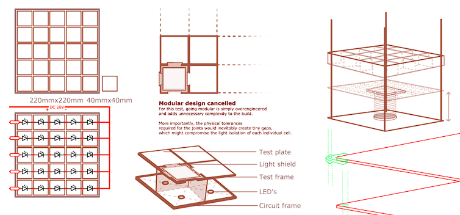

## Platform Architecture

The rig is a vertical measurement stand: light source at the bottom, adjustable sample stage in the middle, observation from above. The layout is basically a stripped-down optical bench — nothing I didn't need, nothing that gets in the way.

  
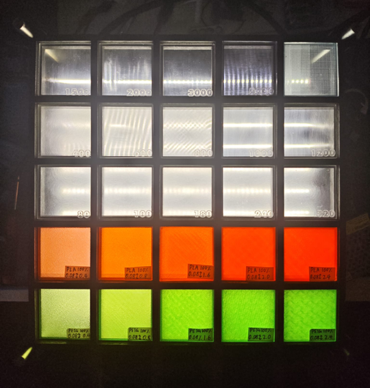
Final 3D Render

  
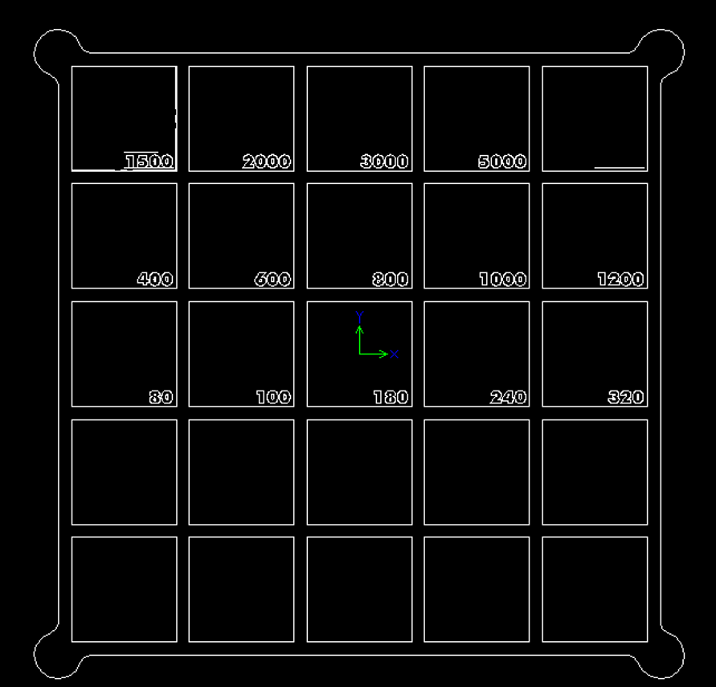
Concept Sketch

### Key Components

- <strong style="color:var(--accent)">Light source</strong>: LED strip with PWM brightness control. Goes from barely glowing to full output, and I can dial in exact levels repeatably.
- <strong style="color:var(--accent)">Sample stage</strong>: Repurposed laboratory lift table. The height adjustment lets me precisely control the distance between the light source and the material — what I call the "diffusion gap." That gap turned out to be surprisingly important.
- <strong style="color:var(--accent)">Frame</strong>: Laser-cut structural panels, spray-painted matte black. The black finish isn't cosmetic — it absorbs stray ambient light and kills internal reflections that would otherwise contaminate measurements.
- <strong style="color:var(--accent)">Control system</strong>: Arduino running a simple PWM routine. Nothing fancy, but it gives me repeatable brightness steps so I can come back to the same settings days later and get the same output.
- <strong style="color:var(--accent)">Power delivery</strong>: Oxygen-free copper wire, minimum 0.5mm² cross-section. Rated for 2A with headroom. This spec became important later (see the iteration section).

## Fabrication Process

  

    
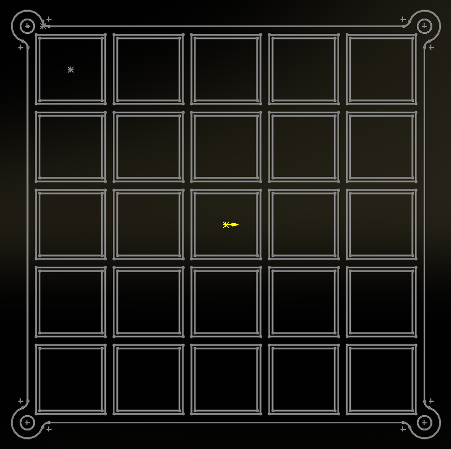STEP 1: 3D Modelling

    
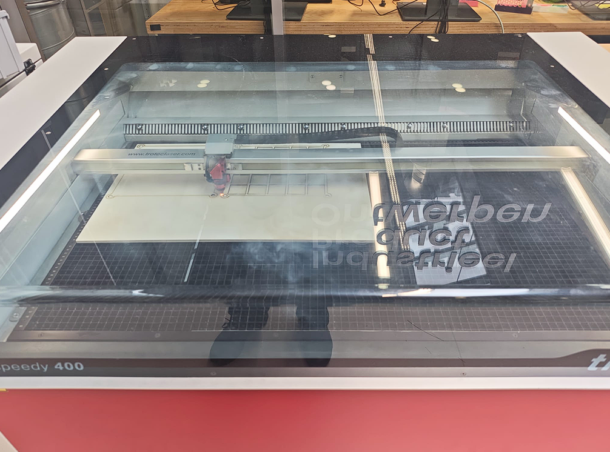STEP 2: Laser Cutting

    
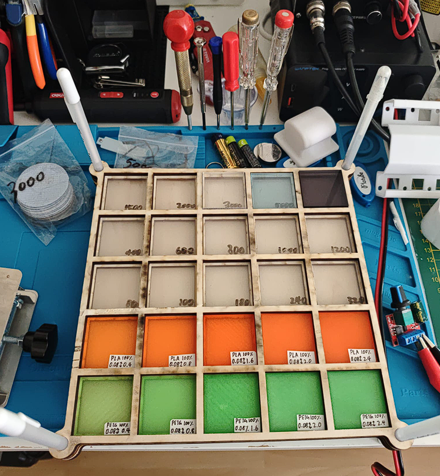STEP 3: Test Build

    
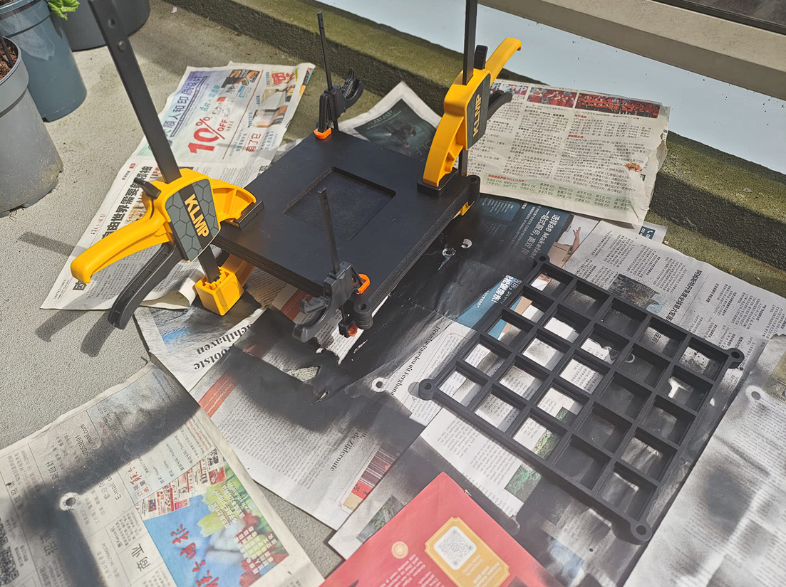STEP 4: Surface Finish

    
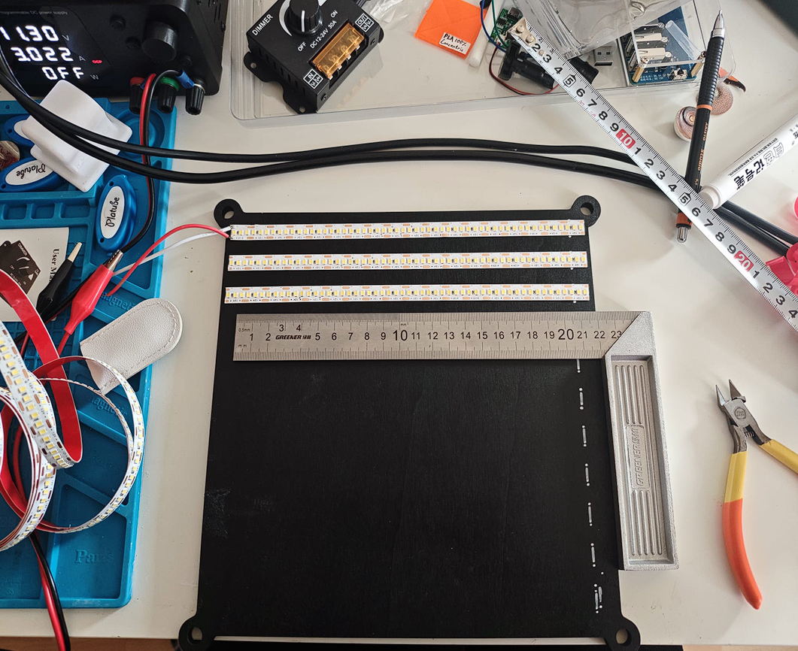STEP 5: Subassembly

    
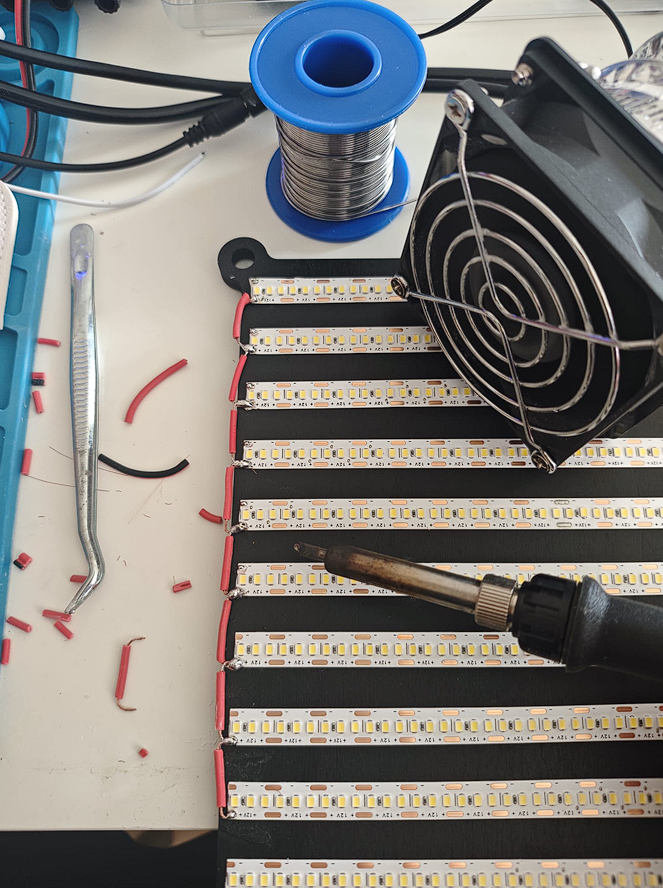STEP 6: Circuit Soldering

    
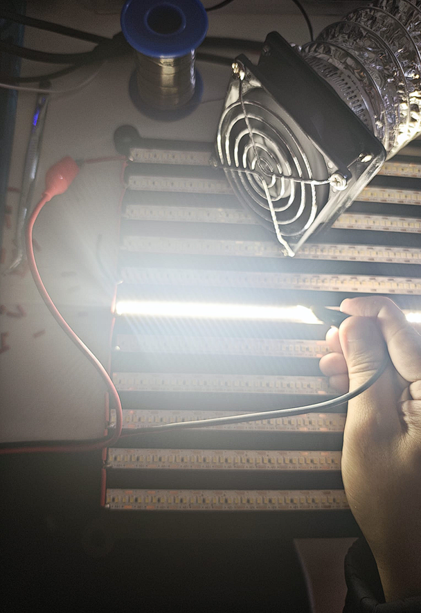STEP 7: Circuit Verification

    
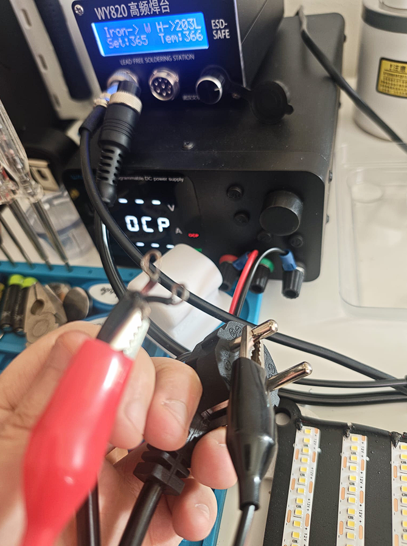STEP 8: Polarity Check

    
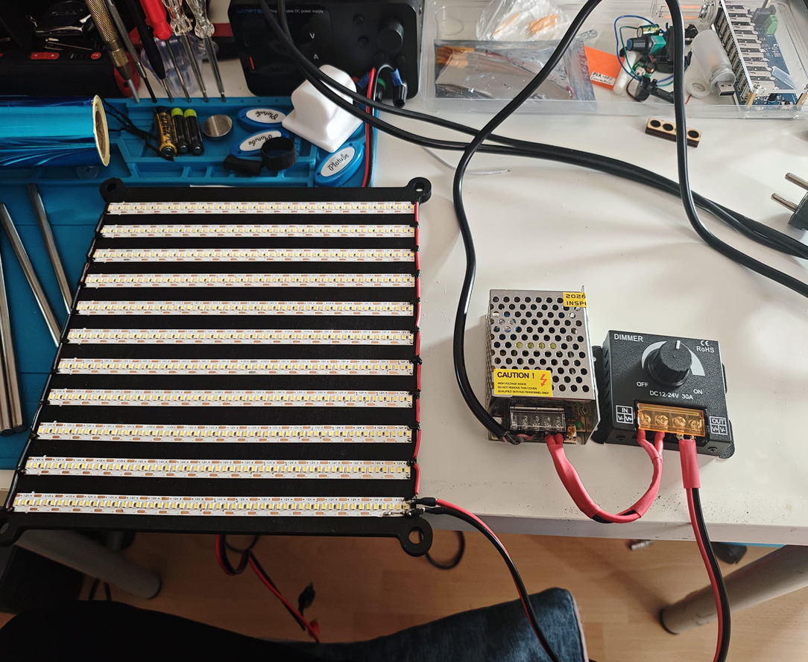STEP 9: Final Assembly

    
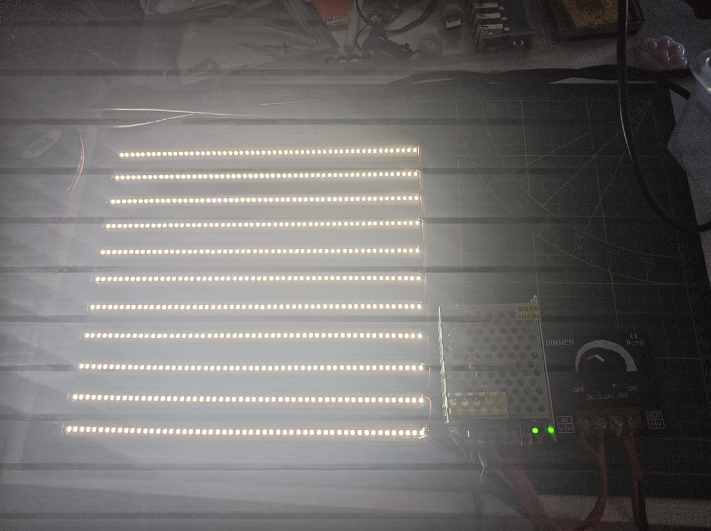STEP 10: Circuit Testing

    
STEP 1: 3D Modelling

    
STEP 2: Laser Cutting

    
STEP 3: Test Build

    
STEP 4: Surface Finish

    
STEP 5: Subassembly

    
STEP 6: Circuit Soldering

    
STEP 7: Circuit Verification

    
STEP 8: Polarity Check

    
STEP 9: Final Assembly

    
STEP 10: Circuit Testing

    
STEP 1: 3D Modelling

    
STEP 2: Laser Cutting

    
STEP 3: Test Build

    
STEP 4: Surface Finish

    
STEP 5: Subassembly

    
STEP 6: Circuit Soldering

    
STEP 7: Circuit Verification

    
STEP 8: Polarity Check

    
STEP 9: Final Assembly

    
STEP 10: Circuit Testing

  

# Material Testing

I tested a range of translucent and transparent materials that show up frequently in product enclosures, diffusers, and light guides:

### Test Material Matrix

| Material                    | Type                   | Key Characteristic                                                       |
| --------------------------- | ---------------------- | ------------------------------------------------------------------------ |
| **Translucent PLA**         | 3D-printed             | Layer-line scattering, cheap for prototyping                             |
| **Translucent PETG**        | 3D-printed             | Better clarity than PLA, stronger layer adhesion                         |
| **Acrylic Sheet**           | Laser Cut              | Great optical clarity, scratch-resistant, lots of surface finish options |
| **AB Epoxy Resin Plate**    | Cast resin             | High transparency, smooth surface, glass alternative                     |
| **PC Light Diffuser Sheet** | Extruded polycarbonate | Purpose-built for diffusion, prismatic surface texture                   |

Each material went through multiple configurations — different thicknesses, different surface finishes, different distances from the light source — so I could see how material choice actually affects the final visual output.

# Controllable Variables

The whole point of building a test rig instead of just holding things up to a lamp was to change one thing at a time. Systematic A/B testing is only possible if you can lock every variable except the one you're studying.

- <strong style="color:var(--accent)">Light Intensity</strong> — PWM-controlled, from barely visible to full blast
- <strong style="color:var(--accent)">Material Type</strong> — PLA, PETG, Acrylic, AB Epoxy, PC Diffuser
- <strong style="color:var(--accent)">Material Color</strong> — Natural, white, and tinted variants of each
- <strong style="color:var(--accent)">Material Thickness</strong> — Single layer, stacked layers, different sheet gauges
- <strong style="color:var(--accent)">Surface Finish</strong> — Raw print, sanded (80–5000 grit), polished, textured
- <strong style="color:var(--accent)">Diffusion Distance</strong> — The gap between light source and sample, adjusted via the lift table

# Three Versions to Get It Right

The platform didn't arrive fully formed. I built it three times, and each version fixed something the previous one got wrong.

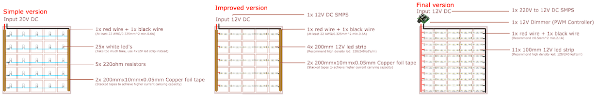

|                          | V1 — Single LED                                         | V2 — LED Strip                                              | V3 — LED Strip + PWM                                                                     |
| ------------------------ | ------------------------------------------------------- | ----------------------------------------------------------- | ---------------------------------------------------------------------------------------- |
| <strong>Method</strong>  | Hand-soldered                                           | Copper foil tape                                            | PWM controller                                                                           |
| <strong>Issues</strong>  | ✕ Soldering too slow | ✕ Tape unsuitable for 2A | ✓ Brightness adjustable                 |
|                          | ✕ Light effect poor  | ✕ No brightness control  | ✓ Diffuse reflection from dark surfaces |
| <strong>Verdict</strong> | ✕ Discarded          | ✕ Discarded              | ✓ Final                                 |

### V1: Single LED — Manual Solder

I started with individual LEDs hand-soldered to a perfboard. It was the obvious first approach, and it was wrong in exactly the ways you'd expect.

- **Issue:** Hand-soldering twenty LEDs is tedious and inconsistent. Each joint has slightly different resistance, so each LED glows a tiny bit differently. For a test platform, "tiny bit differently" is fatal.
- **Issue:** A single-point light source creates uneven illumination across the sample. If the light isn't uniform to begin with, you can't tell whether the diffusion pattern you're seeing is from the material or from the source.

### V2: LED Strip — Copper Foil Tape

I swapped the individual LEDs for a uniform LED strip and used copper foil tape for the electrical connections. Better, but new problems.

- **Issue:** Copper foil tape is convenient and looks clean, but it can't handle 2A. I ran the numbers on cross-sectional area and realized this was a fire hazard waiting to happen. Prototype aesthetics don't count for much when your wiring is undersized.
- **Issue:** Fixed brightness. No matter what material or distance I was testing, the light output was the same. Different scenarios need different illumination levels, and I had no way to adjust.

### V3: LED Strip + PWM Controller (Current Version)

This is the one that stuck:

- **Upgrade:** Ripped out the copper tape and replaced it with oxygen-free copper wire (min 0.5mm²). Properly rated for 2A with margin to spare. Less convenient to work with than tape, but convenience doesn't matter if your test rig burns.
- **Upgrade:** Added an Arduino-based PWM controller for full-range brightness adjustment. Now I can test at 10%, 50%, 100%, or anywhere in between — and get the same reading every time.
- **Upgrade:** Painted the interior frame matte black. This sounds trivial, but the improvement in measurement consistency was dramatic. Ambient light and internal reflections had been silently contaminating every reading I took in V1 and V2.

# What the Platform Delivers

The finished rig gives me a reliable, repeatable environment for comparing how materials handle light:

- <strong style="color:var(--accent)">Side-by-side material comparison</strong> under identical lighting — no more "I think this one looks better"
- <strong style="color:var(--accent)">Surface finish evaluation</strong> — how does sanding, polishing, or texturing change the way light moves through?
- <strong style="color:var(--accent)">Thickness vs transmission analysis</strong> — how much does doubling the sheet thickness actually reduce brightness?
- <strong style="color:var(--accent)">Controlled brightness sweeps</strong> — see how materials behave across the full dimming range, not just at one setting
- <strong style="color:var(--accent)">Visual documentation</strong> of light distribution patterns I can reference on future projects

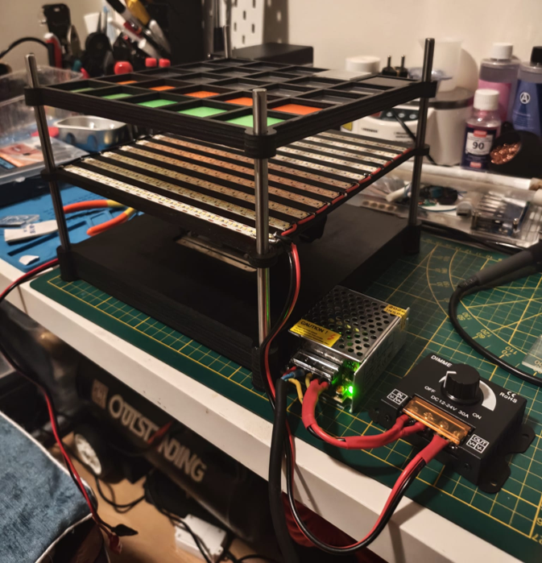

## What Building It Taught Me

Beyond the CMF data, building this platform drilled in a few principles that apply to pretty much any design-build project:

- <strong style="color:var(--accent)">Current ratings aren't suggestions</strong>: The copper tape failure was a concrete reminder that prototyping materials need to be evaluated against their actual electrical loads. It doesn't matter how clean the build looks if the wiring is undersized. Safety specs aren't negotiable.
- <strong style="color:var(--accent)">Your environment is part of your instrument</strong>: Optical measurements live and die by ambient light control. That matte black paint job — which took maybe twenty minutes — improved measurement consistency more than any other single change. Sometimes the simplest fix has the biggest impact.
- <strong style="color:var(--accent)">Isolate one variable at a time or you're just guessing</strong>: The ability to change material, thickness, finish, or distance independently is what turns this from "holding things up to a lamp" into actual testing. Systematic comparison only works if you can hold everything steady except the one thing you're studying.
- <strong style="color:var(--accent)">Tools pay for themselves across projects</strong>: Spending time on a proper test platform feels slow at first, but every future CMF decision involving translucent materials now references real measurements instead of squinting and hoping. That's a compounding return.
