# Op-amps en spanningscomparators

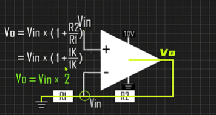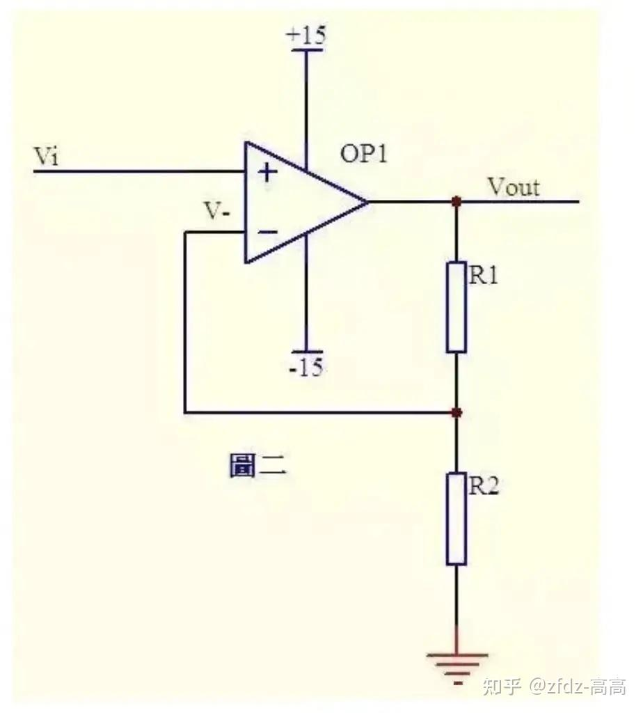

Bronnen: [Bilibili](https://www.bilibili.com/video/BV1VeQdYUELe) [Zhihu](https://zhuanlan.zhihu.com/p/1928161464247620032)

Een **operationele versterker** is in wezen een differentiële versterker met een extreem hoge versterkingsfactor. Hij vertrouwt op een extern terugkoppelingsnetwerk om precieze, beheersbare spanningsversterking te bereiken. In echte projecten is zijn belangrijkste taak om zwakke analoge signalen van sensoren op te nemen, te versterken, te filteren, te conditioneren en om te zetten in iets dat de MCU betrouwbaar kan uitlezen.

## Kernkenmerken

- **Virtueel open**: de ingangen van een op-amp hebben een extreem hoge impedantie (1MΩ+), waardoor er vrijwel geen stroom loopt. Zie ze als probes die de signaallijn aanraken zonder die te beïnvloeden. In de analyse behandel je beide ingangen gewoon als open circuits. Dit wordt het virtueel open genoemd; een afkorting voor "schijnbaar open circuit".
- **Virtuele kortsluiting**: bij aanwezigheid van negatieve terugkoppeling doet de op-amp zijn uiterste best om de spanning op de inverterende ingang (-) gelijk te maken aan die op de niet-inverterende ingang (+). Elke versterkingsberekening is hierop terug te voeren. Toen ik dit voor het eerst echt begreep, vielen ineens een heleboel schakelingen op hun plaats.

## Overige kenmerken

- **Uitgangsverzadiging**: de uitgang kan de voedingsrails niet overschrijden; de uitgang van een op-amp wordt altijd begrensd door de voedingsrails, meestal net eronder. Als de theoretisch versterkte waarde de voeding overschrijdt, clipt de uitgang en ben je niet meer lineair.
- De **spanningsvolger** is het speciale geval met Rf=0, Rg=∞, wat een versterking van 1 geeft. Hij versterkt de spanning niet; in plaats daarvan zet hij een zwak, hoogimpedant sensorsignaal om in een sterk, laagimpedant stuursignaal, en buffert hij de ene trap ten opzichte van de volgende.

## Niet-inverterende versterker

Het signaal komt binnen op de (+) ingang. De terugkoppelingsweerstand Rf (R2) verbindt de uitgang met (-), en Rg (R1) loopt van (-) naar aarde. De uitgang stijgt actief totdat de spanningsdeler gevormd door Rf en Rg gelijk is aan de ingangsspanning.

### Formule: Vout = Vin × (1 + Rf/Rg)

Afleiding:
Vi en V- zijn virtueel kortgesloten, dus Vi = V- …(a)
Door het virtueel open loopt er geen stroom de inverterende ingang in. De stroom door R1 en R2 is gelijk; noem die I:
I = Vout / (R1 + R2) …(b)
Vi is gelijk aan de spanning over R2: Vi = I × R2 …(c)
Uit (a), (b), (c) volgt: Vout = Vi × (R1 + R2) / R2

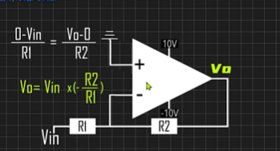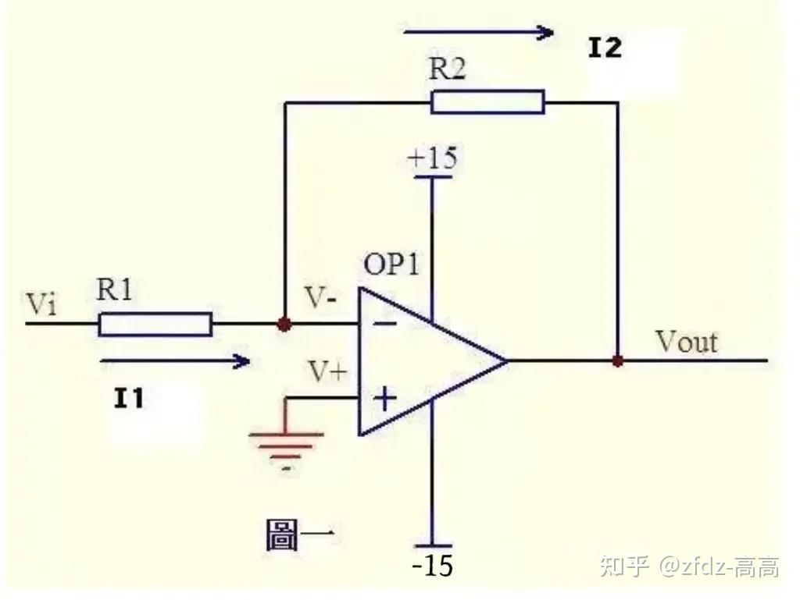

## Inverterende versterker

Het signaal komt binnen op de inverterende ingang (-); de niet-inverterende ingang (+) ligt aan aarde. De uitgang is 180° in tegenfase met de ingang: gaat de ingang omhoog, dan gaat de uitgang omlaag.

### Formule: Vout = (-R2/R1) × Vi

Afleiding:
De niet-inverterende ingang ligt aan aarde = 0V. De virtuele kortsluiting dwingt de inverterende ingang ook naar 0V. Virtueel open betekent dat er bijna geen stroom de op-amp-ingangen in of uit gaat, dus R1 en R2 staan effectief in serie met dezelfde stroom door beide.

Stroom door R1: I1 = (Vi - V-) / R1 …(a)
Stroom door R2: I2 = (V- - Vout) / R2 …(b)
V- = V+ = 0 …(c)
I1 = I2 …(d)

Samen opgelost: Vout = (-R2/R1) × Vi

## Niet-inverterend versus inverterend

| Eigenschap        | Niet-inverterend          | Inverterend                  |
| --------------- | ---------------------- | -------------------------- |
| Ingangsimpedantie | Extreem hoog (MΩ)    | Gelijk aan Rin (kΩ)            |
| Versterking            | 1+Rf/Rg, ≥1            | −Rf/Rin, kan <1 zijn         |
| Uitgangsfase    | Zelfde als ingang          | Geïnverteerd                   |
| Virtuele aarde  | Nee                     | Ja, op de inverterende ingang    |
| Typisch gebruik     | Hoogohmige buffer, sensoren | Audiomix, inversie, I-V  |

De **virtuele aarde** is vooral belangrijk in de inverterende configuratie. Omdat de (+) ingang aan echte aarde ligt, trekt de virtuele kortsluiting ook de (-) ingang naar ~0V; maar deze 0V is geen echte aardverbinding. De uitgang van de op-amp houdt die actief in stand via de terugkoppelingsweerstand. De ingangsimpedantie die de signaalbron ziet, is gewoon Rin zelf, meestal een paar kΩ tot tientallen kΩ; totaal anders dan de bijna oneindige impedantie van de niet-inverterende configuratie. De inverterende ingang hangt op een onzichtbaar nulpunt.

## Niet-inverterende versterker in echte producten

- **Elektronische weegschalen / druksensoren**: het zwakke differentiële signaal van een brugsensor wordt versterkt via een instrumentatieversterker (of een structuur met drie op-amps) en daarna naar de ADC gevoerd. Het bereikontwerp moet clippen voorkomen.
- **Temperatuurregelaars**: microvoltsignalen van thermokoppels worden versterkt; daarna gaat het ene pad naar het display en het andere naar een comparator die met een ingestelde drempel vergelijkt en een relais aanstuurt.
- **PIR-infrarood-bewegingssensoren**: de PIR geeft een minuscuul AC-signaal af, dat via een op-amp-banddoorlaatfilter wordt versterkt en vervolgens door een comparator wordt gedetecteerd om verlichting te triggeren.
- **Motorstroommeting**: de millivoltdaling over een shuntweerstand wordt versterkt en naar de MCU gestuurd voor overstroombeveiliging.
- **Audioproducten**: het signaal van een elektreetmicrofoon wordt AC-versterkt en gefilterd en daarna naar een eindversterker of ADC gevoerd.

## Inverterende versterker in echte producten

- **Audiomixers**: meerdere audiokanalen gaan elk door hun eigen Rin en worden allemaal opgeteld op het virtuele aardpunt van de inverterende op-amp. Kanalen storen elkaar niet. Dit is de klassieke "opteller"-toepassing.
- **Inversie van sensorsignalen**: sommige sensoren geven in de tegengestelde richting van de fysieke grootheid uit (bijv. druk omhoog → spanning omlaag). Eén inverterende trap draait het signaal weer goed voordat het bij de MCU komt.
- **Stroom-naar-spanningomzetting**: laat Rin helemaal weg, stuur de sensorstroom rechtstreeks de inverterende ingang in en gebruik Rf om stroom lineair naar spanning om te zetten. Fotodiodedetectiecircuits doen dit bijna altijd.
- **Bouwsteen voor differentiële versterkers**: combineer inverterende en niet-inverterende trappen om zwakke differentiële signalen uit rumoerige common-mode-omgevingen te halen. Industriële sensor-front-ends maken hier veelvuldig gebruik van.

## Ontwerpaantekeningen: wat ik heb geleerd

- **Hoofdruimte ten opzichte van de voedingsrails**: standaard op-amps (zoals de LM358) kunnen niet tot aan de rails uitslaan. Bij een 5V-voeding is de maximale uitgang ≈ VCC-1.5V = 3.5V. Als de ADC-referentie van je MCU 3.3V is, sluit dat mooi aan. Heb je een rail-to-rail-uitslag nodig, neem dan een rail-to-rail op-amp.
- **Common-mode-bereik van de ingang**: de ingangen van de LM358 gaan tot aan aarde, maar slechts tot VCC-1.5V omhoog. Is je ingang 6V bij een 5V-voeding, dan zit je buiten het common-mode-bereik en gedraagt de op-amp zich onvoorspelbaar.
- **Versterkings-bandbreedteproduct**: de LM358 haalt slechts ~1MHz. Prima voor thermische, optische en langzame signalen; niet voor hoogfrequente zaken.
- **Biasstroompad**: de inverterende ingang heeft via een weerstand een DC-pad naar aarde nodig. De ingangsbiasstroom moet ergens heen; zonder pad stort het "virtueel open" in en drift de uitgang.
- **Ontkoppeling**: een condensator van 0.1μF op de voedingspinnen van de op-amp naar aarde. Sla dit nooit over.
- **Comparatorhysterese**: wanneer de ingang in de buurt van de drempel zweeft, oscilleert een kale comparator wild. Voeg positieve terugkoppeling toe (grote weerstand van de uitgang naar de (+) ingang) om een hystereseraam te creëren. Schoon schakelgedrag. Verplicht voor elk productiecircuit.

Een **comparator** is fundamenteel anders dan een op-amp: hij streeft geen lineariteit na, hij neemt direct binaire beslissingen. V+ > V- → uitgang hoog (of door een externe weerstand naar hoog getrokken), V+ < V- → uitgang laag. Slechts twee uitkomsten: ja of nee.

## Klassieke schakelingen: met de hand afgeleid

### Opteller 1
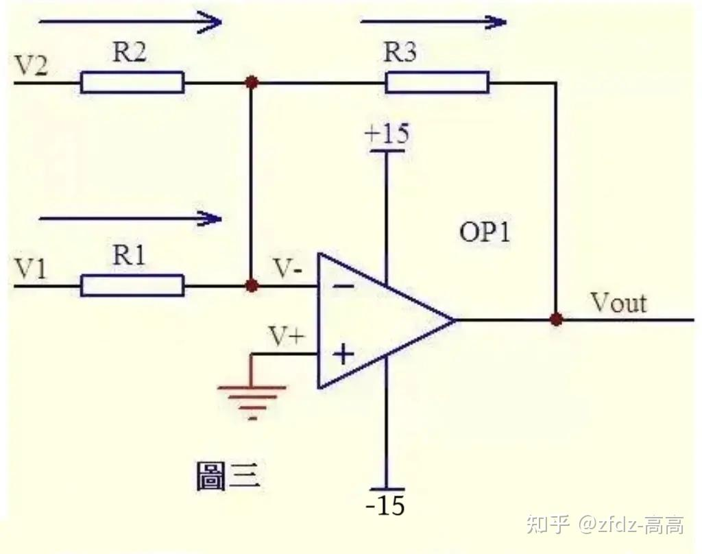

Uit de virtuele kortsluiting: V- = V+ = 0 …(a)
Uit virtueel open en de wet van Kirchhoff volgt dat de som van de stromen door R2 en R1 gelijk is aan de stroom door R3:
(V1 - V-) / R1 + (V2 - V-) / R2 = (V- - Vout) / R3 …(b)
(a) invullen: V1/R1 + V2/R2 = -Vout/R3
Als R1 = R2 = R3, dan: -Vout = V1 + V2

### Opteller 2
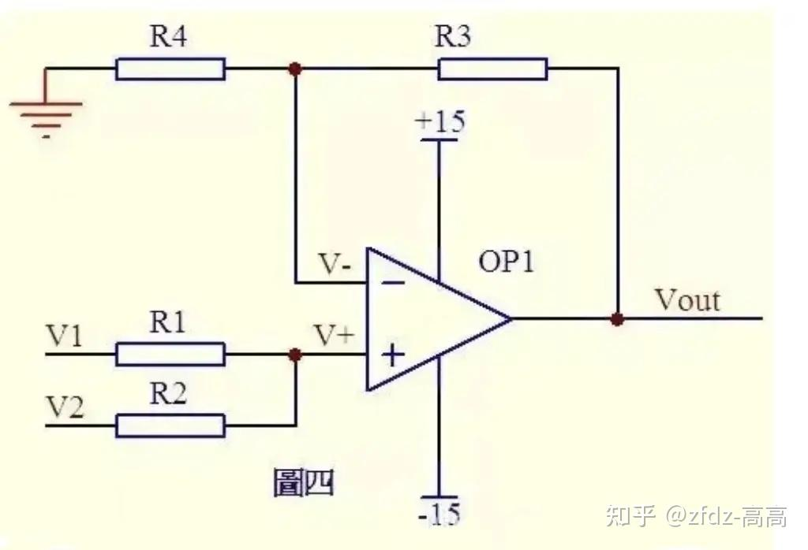

Door het virtueel open loopt er geen stroom de niet-inverterende ingang in. De stroom door R1 is gelijk aan de stroom door R2. Evenzo is de stroom door R4 gelijk aan de stroom door R3:
(V1 - V+) / R1 = (V+ - V2) / R2 …(a)
(Vout - V-) / R3 = V- / R4 …(b)
Uit de virtuele kortsluiting: V+ = V- …(c)
Als R1 = R2 en R3 = R4, dan volgt uit het bovenstaande:
V+ = (V1 + V2) / 2, V- = Vout / 2
Dus: Vout = V1 + V2

### Aftrekker
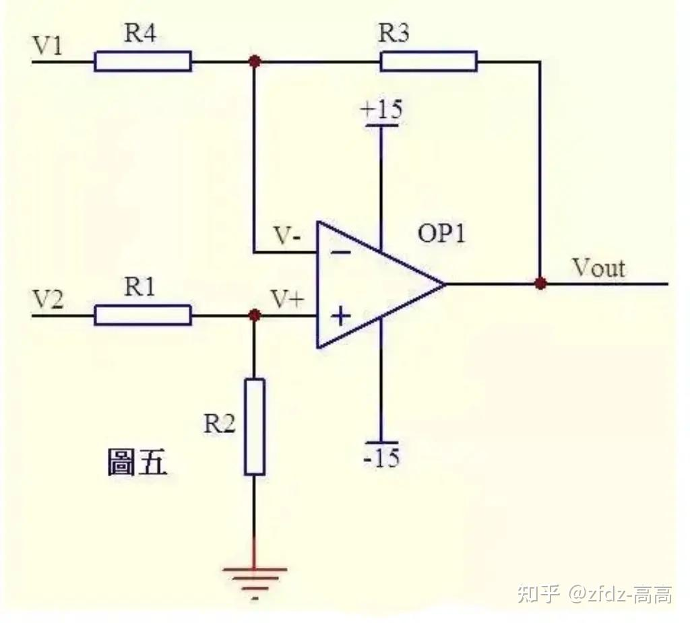

Uit virtueel open volgt dat de stroom door R1 gelijk is aan de stroom door R2. Evenzo is de stroom door R4 gelijk aan de stroom door R3:
(V2 - V+) / R1 = V+ / R2 …(a)
(V1 - V-) / R4 = (V- - Vout) / R3 …(b)
Als R1 = R2: V+ = V2 / 2 …(c)
Als R3 = R4: V- = (Vout + V1) / 2 …(d)
Uit de virtuele kortsluiting: V+ = V- …(e)
Dus: Vout = V2 - V1; de klassieke aftrekker.

### Integrator
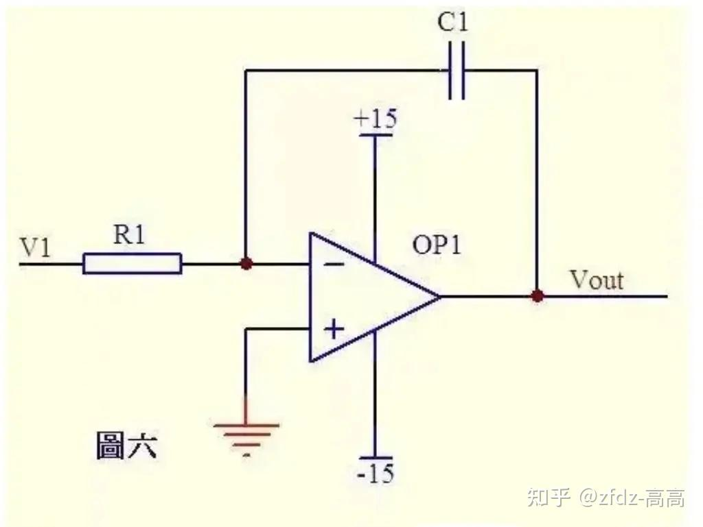

Uit de virtuele kortsluiting volgt dat de spanning op de inverterende ingang gelijk is aan die op de niet-inverterende ingang. Uit virtueel open volgt dat de stroom door R1 gelijk is aan de stroom door C1.

Stroom door R1: i = V1 / R1
Stroom door C1: i = C × dUc/dt = -C × dVout/dt
Dus: Vout = (-1/(R1 × C1)) ∫ V1 dt

De uitgangsspanning is evenredig met de integraal van de ingangsspanning over de tijd. Is V1 een constante spanning U, dan:
Vout = -U × t / (R1 × C1)

t is de tijd en Vout is een rechte lijn die lineair van 0 richting de negatieve voeding oploopt.

### Differentiator
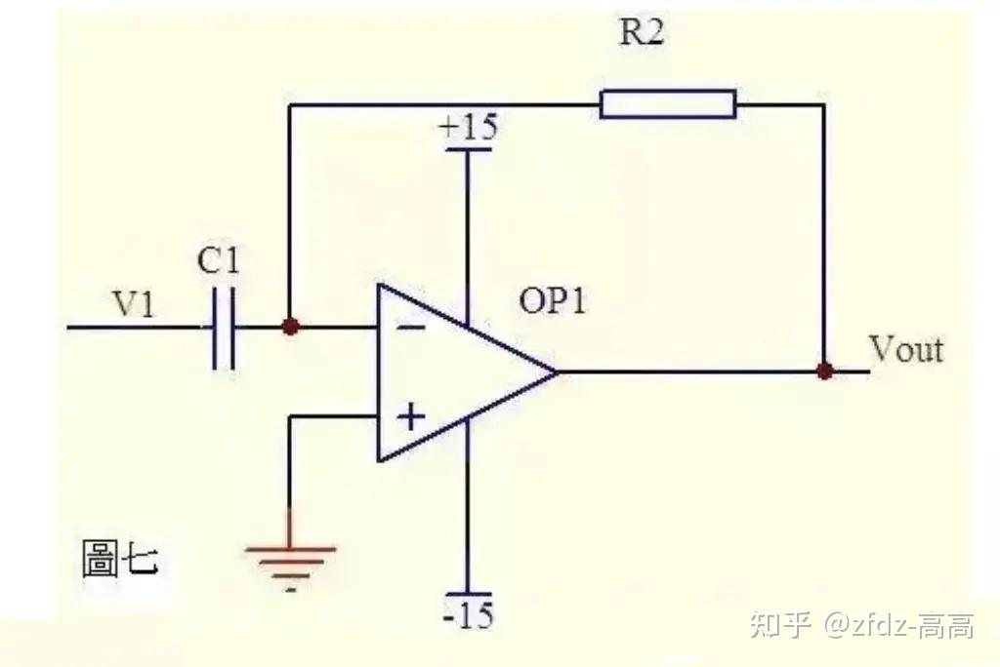

Uit virtueel open volgt dat de stroom door condensator C1 en weerstand R2 gelijk is. Uit de virtuele kortsluiting volgt dat de op-amp-ingangen op gelijke spanning staan:
Vout = -i × R2 = -(R2 × C1) dV1/dt

Is V1 een plotseling aangebrachte gelijkspanning, dan produceert Vout een scherpe puls in de tegengestelde richting.

### Differentiële versterker
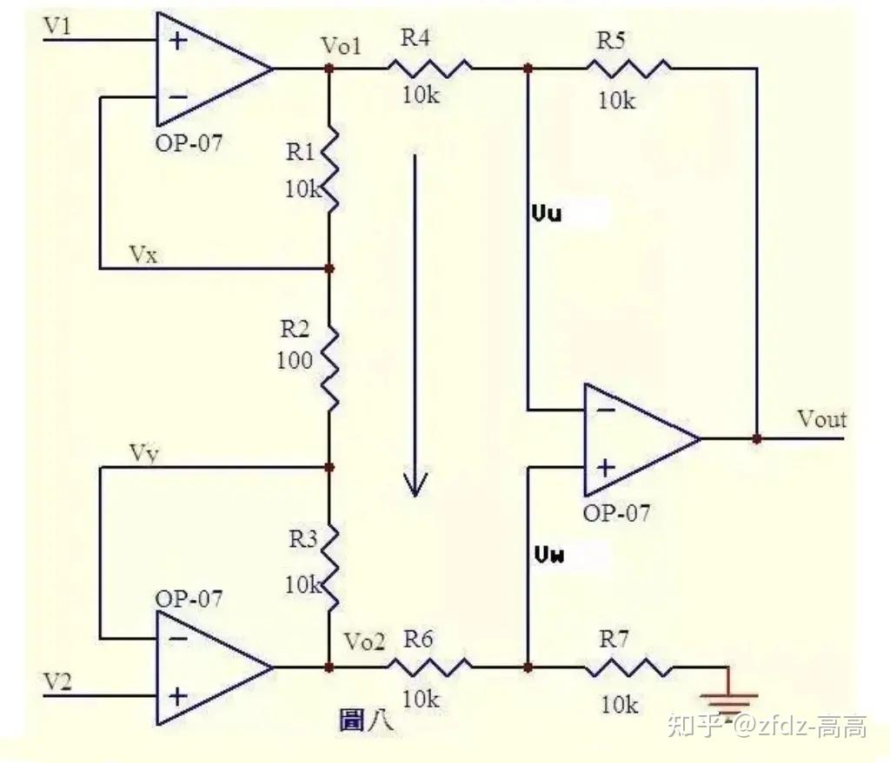

Uit de virtuele kortsluiting: Vx = V1 …(a), Vy = V2 …(b)
Uit virtueel open volgt dat er geen stroom de op-amp-ingangen in loopt. R1, R2 en R3 staan effectief in serie met dezelfde stroom door elk:
I = (Vx - Vy) / R2 …(c)
Dus: Vo1 - Vo2 = I × (R1 + R2 + R3) = (Vx - Vy)(R1 + R2 + R3) / R2 …(d)

Uit virtueel open volgt dat de stroom door R6 gelijk is aan de stroom door R7. Als R6 = R7: Vw = Vo2 / 2 …(e)
Evenzo, als R4 = R5: Vout - Vu = Vu - Vo1, dus: Vu = (Vout + Vo1) / 2 …(f)
Uit de virtuele kortsluiting: Vu = Vw …(g)
Uit (e), (f), (g): Vout = Vo2 - Vo1 …(h)
Uit (d), (h): Vout = (Vy - Vx)(R1 + R2 + R3) / R2

De term (R1+R2+R3)/R2 is een constante die de versterkingsfactor voor het verschil (Vy - Vx) bepaalt. Dit is de differentiële versterker.

### Stroomdetectie (4-20mA)
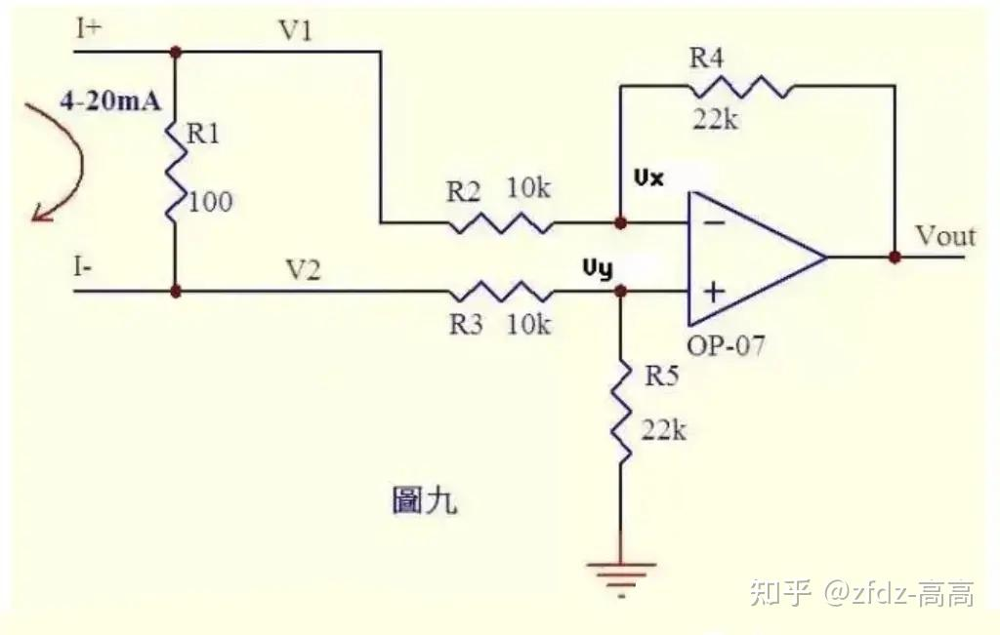

Veel controllers accepteren een stroom van 0~20mA of 4~20mA van instrumentatie. Dit circuit zet die stroom om in een spanning voor de ADC.

De 4~20mA-stroom loopt door een meetweerstand R1 van 100Ω en veroorzaakt daarover een spanningsval van 0.4~2V.

Uit virtueel open volgt dat er geen stroom de op-amp-ingangen in loopt. De stroom door R3 is gelijk aan de stroom door R5, en de stroom door R2 is gelijk aan de stroom door R4:
(V2 - Vy) / R3 = Vy / R5 …(a)
(V1 - Vx) / R2 = (Vx - Vout) / R4 …(b)
Uit de virtuele kortsluiting: Vx = Vy …(c)
Naarmate de stroom varieert van 0~20mA: V1 = V2 + (0.4~2) …(d)
(c) en (d) in (b) invullen: (V2 + (0.4~2) - Vy) / R2 = (Vy - Vout) / R4 …(e)
Als R3 = R2 en R4 = R5, dan geeft (e) - (a): Vout = -(0.4~2)R4/R2 …(f)
Hier geldt R4/R2 = 22k/10k = 2.2, dus: Vout = -(0.88~4.4)V

Met andere woorden: 4~20mA wordt omgezet naar -0.88~-4.4V, klaar voor de ADC. Keer de stroomrichting om en Vout = +(0.88~4.4)V.

### Spanning-naar-stroomomzetter
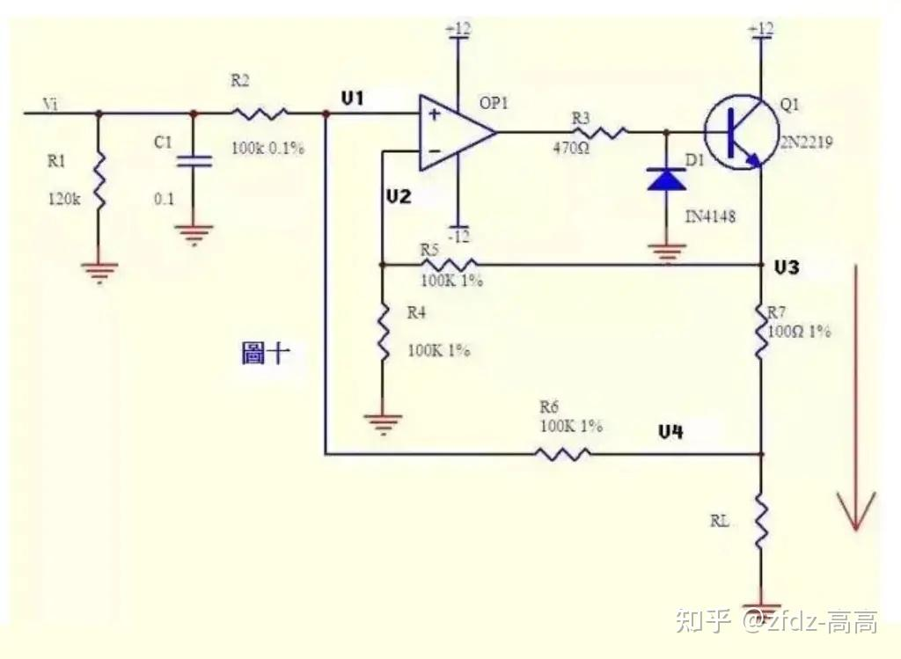

Stroom kan in spanning worden omgezet, en spanning kan in stroom worden omgezet. De negatieve terugkoppeling van dit circuit loopt niet rechtstreeks door een weerstand; die gaat door de emitterovergang van transistor Q1. Verwar dit niet met een comparator; zolang we in het actieve gebied zitten, gelden virtuele kortsluiting en virtueel open nog steeds.

Uit virtueel open: (Vi - V1) / R2 = (V1 - V4) / R6 …(a)
Evenzo: (V3 - V2) / R5 = V2 / R4 …(b)
Uit de virtuele kortsluiting: V1 = V2 …(c)
Als R2 = R6 en R4 = R5, dan volgt uit (a), (b), (c): V3 - V4 = Vi

Dit betekent dat de spanning over R7 gelijk is aan de ingangsspanning Vi, dus de stroom door R7: I = Vi / R7
Als RL << 100kΩ, is de stroom door RL in essentie gelijk aan die door R7.

### PT100-sensorfront-end
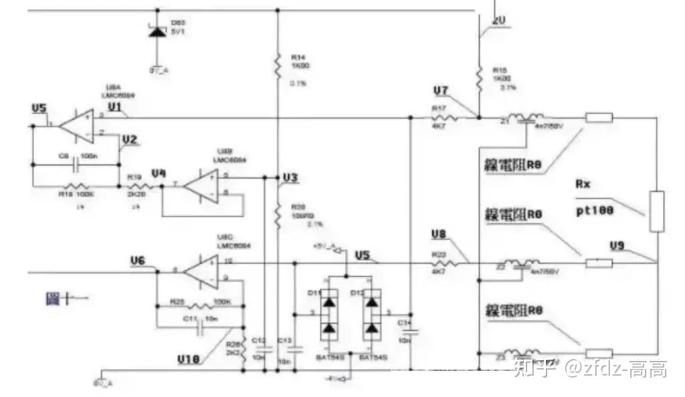

Een PT100-voorversterkercircuit in 3-draadsuitvoering. De PT100-sensor gebruikt drie draden van identiek materiaal, identieke dikte en identieke lengte. Over de brug gevormd door R14, R20, R15, Z1, de PT100 en zijn leidingweerstanden staat 2V. Z1, Z2, Z3, D11, D12, D83 en de condensatoren verzorgen filtering en bescherming; behandel ze voor de statische analyse als kortsluitingen (Z1/Z2/Z3) of open verbindingen (D11/D12/D83 en de condensatoren).

Uit de weerstandsdeler: V3 = 2 × R20 / (R14 + 20) = 200/1100 = 2/11 …(a)
Uit de virtuele kortsluiting volgt dat de spanning op pinnen 6 en 7 van U8B gelijk is aan die op pin 5: V4 = V3 …(b)
Uit virtueel open volgt dat pin 2 van U8A geen stroom trekt. De stroom door R18 is gelijk aan de stroom door R19:
(V2 - V4) / R19 = (V5 - V2) / R18 …(c)
Uit virtueel open volgt dat pin 3 van U8A geen stroom trekt: V1 = V7 …(d)

In de brug staan R15 en Z1 in serie met de PT100 en de leidingweerstanden. De spanning over de PT100 + leidingweerstanden loopt via R17 naar pin 3 van U8A:
V7 = 2 × (Rx + 2R0) / (R15 + Rx + 2R0) …(e)
Uit de virtuele kortsluiting: V1 = V2 …(f)
Uit (a) tot en met (f): (V5 - V7) / 100 = (V7 - V3) / 2.2
Vereenvoudigd: V5 = (102.2 × V7 - 100V3) / 2.2
Oftewel: V5 = 204.4(Rx + 2R0) / (1000 + Rx + 2R0) - 200/11 …(g)

Nu de leidingweerstanden. De spanningsval over de onderste leidingweerstand loopt via de middelste leidingdraad, Z2 en R22 naar pin 10 van U8C.

Uit virtueel open: V5 = V8 = V9 = 2 × R0 / (R15 + Rx + 2R0) …(a')
(V6 - V10) / R25 = V10 / R26 …(b')
Uit de virtuele kortsluiting: V10 = V5 …(c')
Uit (a'), (b'), (c'): V6 = (102.2/2.2)V5 = 204.4R0 / [2.2(1000 + Rx + 2R0)] …(h)

Met het stelsel vergelijkingen (g) en (h) kun je door V5 en V6 te meten Rx en R0 oplossen. Met Rx bekend zoek je in de PT100-tabel de temperatuur op.

### Waar de naam vandaan komt
"Operationele versterker" komt uit het tijdperk van de vroege analoge computers: deze circuits voerden letterlijk wiskundige bewerkingen uit.

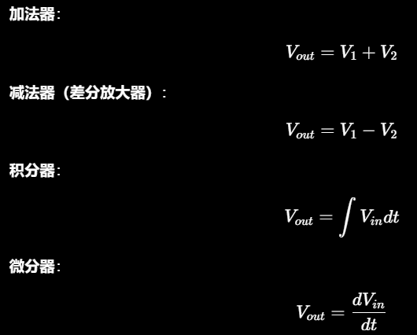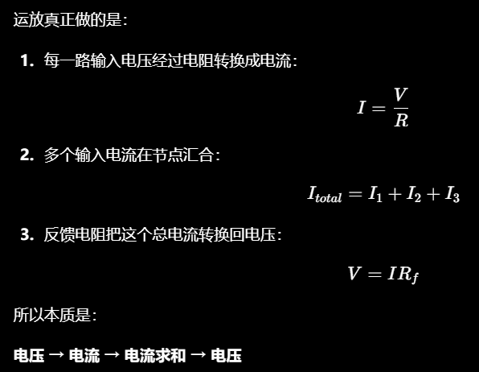

## Samenvatting: op-amp versus comparator

**Op-amps (zoals de LM358)** werken in het **lineaire gebied**. Met negatieve terugkoppeling doen ze hun best om beide ingangen gelijk te houden (de virtuele kortsluiting houdt stand), en de uitgang is een continu variërende analoge spanning, evenredig met de ingang. Ze zijn gebouwd voor **versterking**; precisie, getrouwheid, lage vervorming. Een 0.2V-fotodiodesignaal naar 2V brengen met behoud van de golfvorm, dat is het werk van een op-amp. Je kunt een op-amp tijdelijk open-loop als comparator gebruiken, maar daar is hij niet voor ontworpen.

**Comparators (zoals de LM393)** werken in **verzadiging / open-loop**. Ze laten de twee ingangen bewust uiteenlopen, en de uitgang klapt tegen een rail (hoog of laag); slechts twee toestanden. Ze zijn gebouwd voor **besluitvorming**; snelheid, schoon schakelen, eenduidige logische niveaus. Een drempel van 2.5V instellen en een LED laten branden wanneer die wordt overschreden, dat is het werk van een comparator.

Mijn vuistregel:
- Moet je een **continue analoge waarde lezen** (temperatuurcurve, lichtniveau, drukgolfvorm) → gebruik een **op-amp** voor buffering, versterking en filtering, en voer daarna de ADC.
- Moet je een **binaire beslissing nemen** (temperatuurdrempel bereikt, beweging gedetecteerd, batterij bijna leeg) → gebruik een **comparator** voor een schone hoog/laag-uitgang of interrupttrigger.
