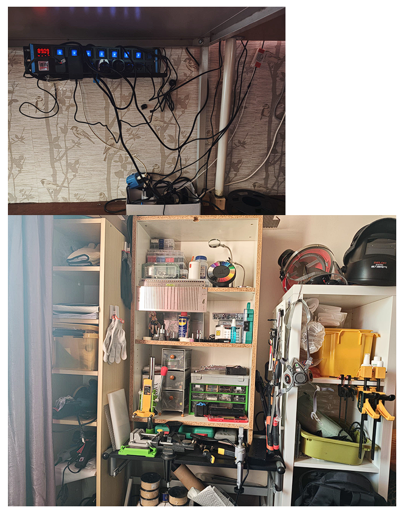

# 概述

本项目记录了对家庭工作室电气基础设施的系统性分析与优化。目标是理解电力分配拓扑、识别安全风险，并设计实用方案以打造安全、专业的工作环境。

本研究基于我在**荷兰（欧洲）**的本地使用场景，当地电气装置须符合 **NEN 1010** 安全规范。电压标准、配电盘结构和保护机制在不同国家有所差异。

# 研究目标

- 系统梳理电力分配结构与用电模式
- 识别当前设置中的潜在安全风险
- 识别主要耗能设备
- 设计安全、可靠、可行的节能方案
- 实施分区供电系统

# 家庭电气系统中的保护机制

在荷兰家庭中，配电盘（_groepenkast_）位于电表柜内。电力通过电网接入后，依次经过以下安全组件：

- **主熔断器与主开关：** 用于全系统断电
- **漏电保护器（RCD）：** 通过检测漏电流防止触电
- **断路器：** 将电路分成若干组，大功率设备配备独立回路
- **接地：** 为故障电流提供安全通路

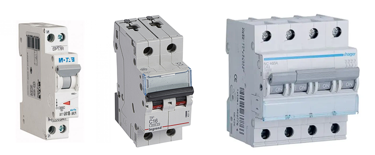

## 断路器：1P 与 2P

- **1P 断路器：** 切断电路，但电器仍通过零线（N）与电网相连
- **2P / 1P+N 断路器：** 切断**两根**导线（相线和零线），确保完全电气隔离

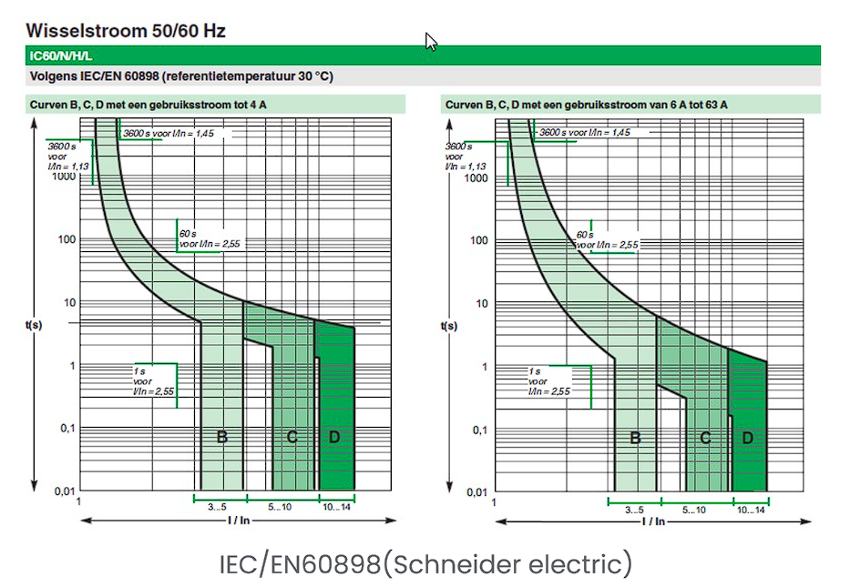

## 脱扣特性

断路器通过自动跳闸来防护过载和短路。常见类型包括 **B、C、D、K、Z 和 MA** 曲线，区别在于磁脱扣电流阈值（以额定电流 In 的倍数表示）。

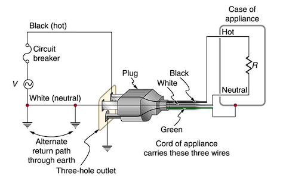

# 家庭用电的潜在风险

## 电缆选型

电缆的横截面积决定了其安全载流量。关键因素包括：

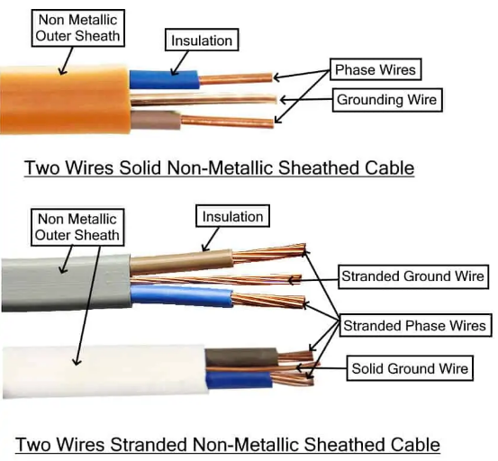
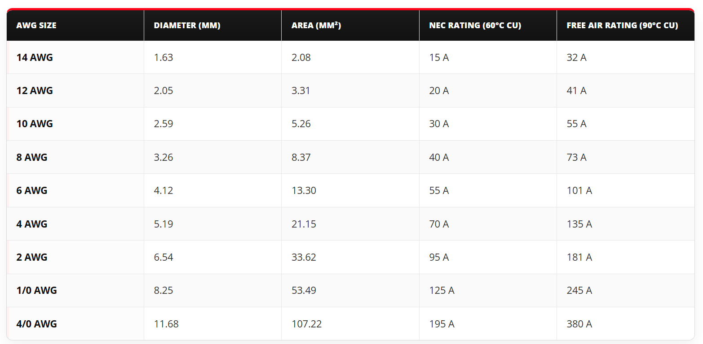

- **材料：** 铜、铝或铜包铝（CCA）
- **芯线类型：** 实心线 vs. 多股线
- **长度：** 越长电阻越大，电压降越大
- **环境温度：** 高温环境下散热更困难
- **电缆密度：** 多根电缆挤在管道中会积聚热量
- **短路电流：** 必须能承受短路时的热应力

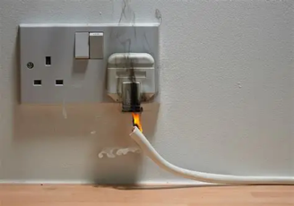

## 线缆缺陷

- 外护套破损
- 过热导致的颜色变化
- 过度弯曲或挤压
- 绝缘材料老化/脆化

## 使用环境

在潮湿环境中需格外谨慎。检查要点：是否正确接地、IP 防护等级是否达标、是否安装了 RCD、接点是否腐蚀。

## 过载、过压与短路

- **同时使用：** 同一回路运行多台大功率设备（最大 10A/16A）
- **长期重载：** 导致电缆过热
- **串联插线板：** 插线板互相串联——重大火灾隐患
- **接触不良：** 高接触电阻产生热量
- **散热受限：** 卷绕的电缆盘必须完全展开
- **缺乏浪涌保护：** 易受电压尖峰影响

# 实际研究

我对工作室的电气基础设施进行了详细分析，重点关注安全性和运行可靠性。核心目标是理解电气拓扑映射并进行风险评估。

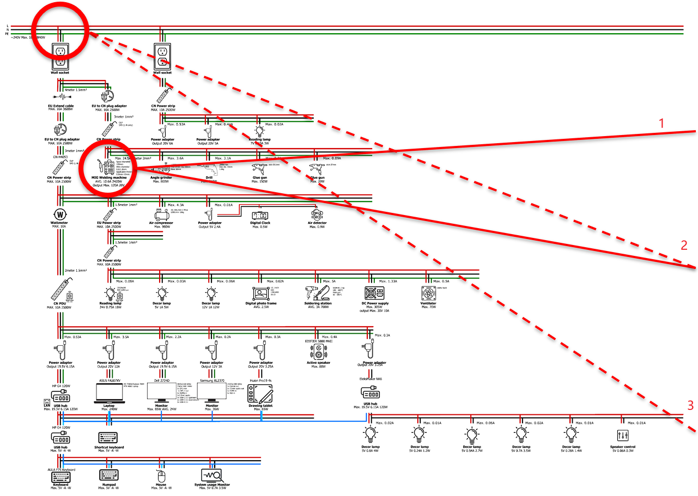

## 识别出的风险与优化方案

### 1. 焊机接地

焊机未接地——存在重大安全隐患。**解决方案：** 直接连接到配电盘的主接地系统。

### 2. 浪涌电流

焊机的浪涌电流（20-30A）超出当前回路容量。**解决方案：** 移至配备大容量断路器的独立回路。

### 3. 脱扣特性

高启动电流设备需使用 C 或 D 曲线断路器。

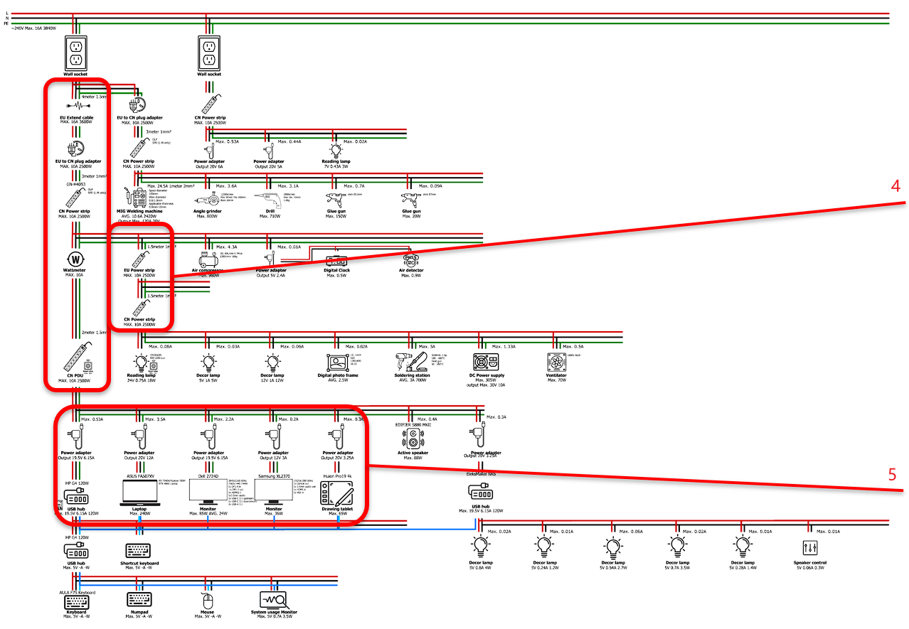

### 4. 消除串联插线板

插线板串联增加接触电阻、热量积聚和火灾风险。**解决方案：** 从树形结构改为星形拓扑，使用高质量 16A 插线板。

### 5. 电压跌落与电磁干扰

大功率设备（空压机、角磨机）引起电压跌落和电磁干扰，影响敏感电子设备。**解决方案：** 大功率设备和精密电子设备分路供电。

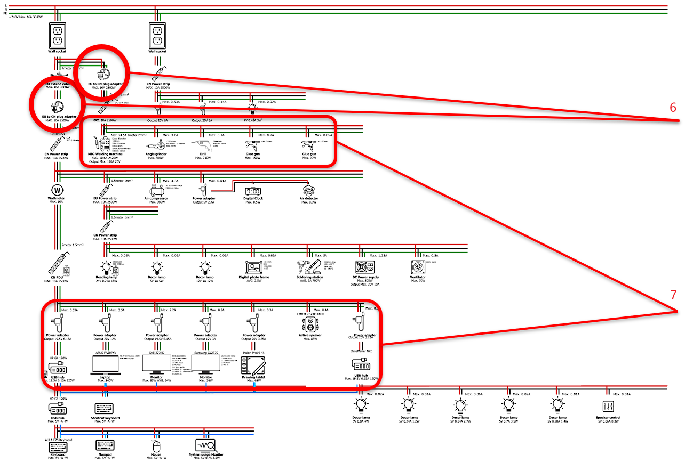

### 6. 转接插头

接触面过小，无法满足大电流应用。**解决方案：** 更换为标准欧规插头或工业级插线板。

### 7. 分区与回路分配

将工作室分为"加工区"和"办公区"，各自独立回路供电。有条件时将线缆从 2.5mm² 升级到 4mm² 或 6mm²。

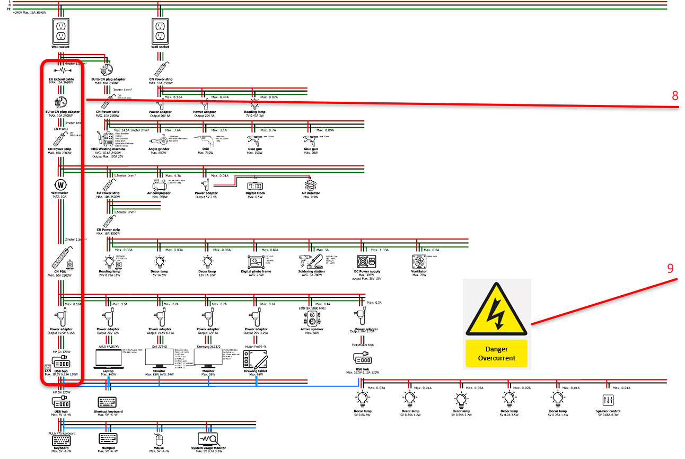

### 8. 直接连接

取消次级插线板。关键设备必须直接插入墙插。

### 9. 预防与警示标识

张贴安全标识——禁止同时启动多台大功率设备，禁止使用卷绕延长线。

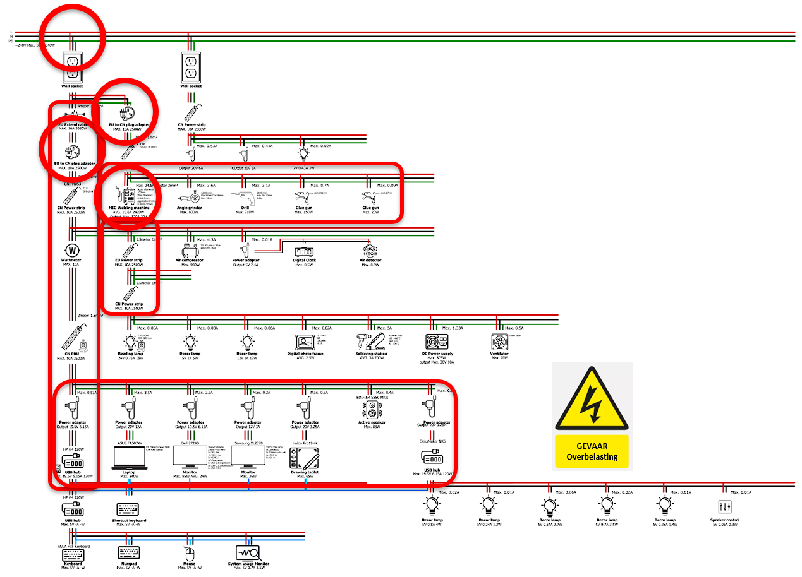
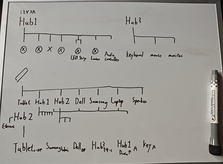

# 结论

本研究共识别出**九项关键风险因素**，从重型设备的接地缺失到串联插线板引起的火灾隐患。分析成果形成了一套具体的优化方案，将工作室转型为安全、专业的工作环境。

现有线路无法同时支撑工业工具和精密电子设备的使用。从串联树形结构过渡到并联星形拓扑，并实现回路分离，是保障消防安全和运行稳定性的必要步骤。

# 优化——落地实施

为降低已识别风险，我实施了设备的物理分区：

- **办公区：** 所有精密电子设备（电脑、显示器）集中在专用区域，与重型设备隔离，防止电磁干扰和电压跌落损坏硬件
- **工作区：** 工业设备和电动工具移至独立房间，将大功率负载与精密电子设备隔离，显著降低回路过载风险，提升基础设施整体稳定性

# 反思

分析现有线路并制定具体改进方案的过程，大幅提升了我的电气安全意识。这项研究不仅带来了技术技能，还培养了对工作环境中物理基础设施潜在风险的批判性、警觉性态度。

# 参考文献

1. [电表柜与主熔断器如何连接？](https://saelektroexperts.nl/en/meterkast-problemen/hoe-werkt-de-aansluiting-van-een-meterkast-op-de-hoofdzekering/)
2. [配电盘概览](https://www.drixes-elektricien.nl/groepenkast/overzicht)
3. [电气安全系统与设备](https://texasgateway.org/resource/68-electrical-safety-systems-and-devices)
4. [电线电缆类型](https://www.mall99.co.ke/types-of-electrical-wires-and-cables/)
5. [电缆尺寸类型 mm AWG BS 转换指南](https://viox.com/cable-size-types-mm-awg-bs-conversion-guide/)
6. [断路器中零线断开的作用是什么？](https://electronics.stackexchange.com/questions/688210/what-is-the-purpose-of-neutral-disconnect-in-a-circuit-breaker)
7. [线径知识库](https://www.elektramat.nl/kennisbank/aderdikte/)
8. [电缆截面计算器](https://builder-calc.com/nl/elektronica/kabeldoorsnedecalculator-op-basis-van-vermogen-en-stroom-online-berekening.html)
