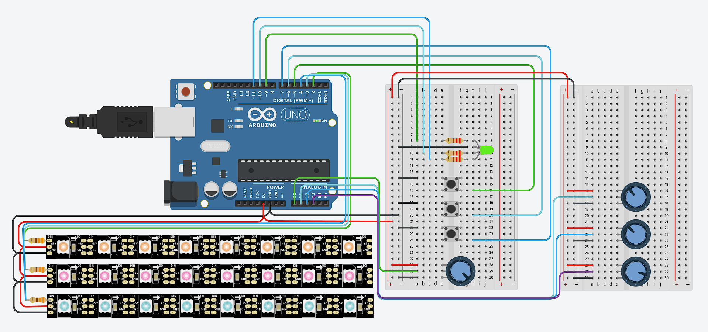

# Overzicht

Voordat ik me vastlegde op echte hardware, wilde ik eerst een meerkanaals LED-controller prototypen in een simulatie. Tinkercad Circuits is verrassend capabel voor dit soort dingen: het geeft je een virtuele Arduino, NeoPixel-strips, potentiometers, knoppen en een werkende Serial Monitor, allemaal zonder ook maar iets te solderen.

Het circuit stuurt drie onafhankelijke NeoPixel-strips aan. Met drie drukknoppen kies je welke strip "actief" is, en vier potentiometers verzorgen de kleurmenging: drie voor RGB, één voor de hoofdhelderheid. De geselecteerde strip wordt in realtime bijgewerkt, terwijl de andere twee hun laatste toestand vasthouden. Een kleine status-LED spiegelt de kleur van het actieve kanaal, zodat je in één oogopslag ziet welke strip je aan het bewerken bent.

# Bediening

- **3 drukknoppen:** Selecteren de actieve LED-strip (1, 2 of 3). Een knop indrukken maakt die strip actief en werkt de status-LED bij.
- **3 potentiometers:** R-, G- en B-waarden, omgezet van 0-1023 (analoog inlezen) naar 0-255 voor de NeoPixel-uitvoer.
- **1 potentiometer:** Hoofdhelderheid voor de actieve strip. Wordt toegepast als schaalfactor nadat de RGB-waarden zijn ingesteld.
- **RGB-status-LED:** Brandt rood, groen of blauw om aan te geven welk kanaal is geselecteerd. Simpel maar effectief; je hoeft niet naar de Serial Monitor te kijken om te weten wat je aan het bewerken bent.

# Codestructuur

```cpp
struct LightState {
  int r, g, b, brightness;
};

LightState lights[3];  // one per strip

void loop() {
  // Read buttons → select strip
  // Read pots → update current strip RGB + brightness
  // Apply: output = color × brightness / 255
  // Update status LED colour
}
```

De schaalformule voor helderheid `output = base_color × brightness / 255` houdt het simpel: elk kanaal wordt evenredig gedimd zonder dat de tint verschuift. Dat is belangrijker dan je zou denken; als je de ruwe waarden gewoon afkapt, krijg je kleurvervorming bij lage helderheid.

# Toekomstige overweging

HSV (Hue, Saturation, Value) aansturen in plaats van RGB is waarschijnlijk intuïtiever wanneer je daadwerkelijk voor de hardware staat en aan fysieke knoppen draait. Bij HSV zit de helderheidspotentiometer direct op de V-component; precies wat je zou verwachten. De drie kleurpotentiometers zouden dan tint, verzadiging en iets anders kunnen regelen (misschien witbalans of kleurtemperatuur). RGB is prima voor een proof of concept, maar het is niet hoe mensen over kleur denken. Ik kom hier waarschijnlijk op terug wanneer ik de fysieke versie bouw.

# Resultaat

De Tinkercad-simulatie bevestigde dat de aanpak werkt voordat ik ook maar een cent aan hardware uitgaf:

- Drie onafhankelijke LED-strips die elk hun eigen toestand in het geheugen bijhouden. Schakel je naar een andere strip, dan blijft de kleur gewoon staan.
- Kanaalselectie via knoppen met nette ontdendering (de gesimuleerde knoppen van Tinkercad zijn, toegegeven, schoner dan echte knoppen).
- Realtime RGB- en helderheidsregeling via vier potentiometers. De analoog-naar-digitaalomzetting van 0-1023 naar 0-255 is een simpele deling, maar werkt goed genoeg voor een simulatie.
- De statusindicator-LED geeft duidelijke visuele feedback over welk kanaal actief is. Een klein detail, maar het zorgt ervoor dat de interface doordacht aanvoelt in plaats van giswerk.
